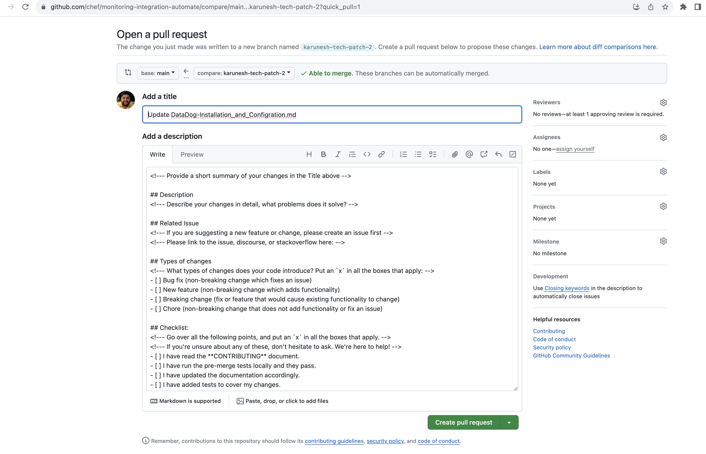

# Contributing to CONTRIBUTING.md

First off, thanks for taking the time to contribute!

All types of contributions are encouraged and valued. See the [Table of Contents](#table-of-contents) for different ways to help and contribute to this repository. Please make sure to read the relevant section before making your contribution. It will make it a lot easier for us maintainers and smooth out the experience for all involved. 

## Table of Contents

- [About the project](#about-the-project)
- [I Have a Question](#i-have-a-question)
- [I Want To Contribute](#i-want-to-contribute)
- [Reporting Bugs](#reporting-bugs)
- [Suggesting Enhancements](#suggesting-enhancements)
- [Your First Code Contribution](#your-first-code-contribution)
- [Improving The Documentation](#improving-the-documentation)
- [Styleguides](#styleguides)
- [Commit Messages](#commit-messages)
- [Join The Project Team](#join-the-project-team)

## About the project

The Chef Automate HA equates to reliability, efficiency, and productivity, built on Redundancy and Failover. It aids in addressing significant issues like service failure and zone failure. Please refer to the public  [documentation](https://docs.chef.io/automate/ha/)  of Automate HA for more information.

This project is a documentation-only repository that provides guided steps on how to build and integrate Monitoring, Alerting, and Centralised logging tools with Chef Automate HA. Based on our analysis we have selected a few tools which is our recommendation.

## I Have a Question

> If you want to ask a question, we assume that you have read the available [Documentation of the repository](https://github.com/chef/monitoring-integration-automate/blob/Adding-Contributing.md/Whitepaper_AutomateHA_Monitoring_and_Alerting.md) and [Automate product] (https://docs.chef.io/automate/ha/).

Before you ask a question, it is best to search for existing [Issues](/issues) that might help you. In case you have found a suitable issue and still need clarification, you can write your question in this issue. It is also advisable to search the internet for answers first.

If you still feel the need to ask a question and need clarification, we recommend the following:

- Open an [Issue](/issues/new).
- Provide as much context as you can about what you're running into.
- Provide project and platform versions, depending on what seems relevant.

We will then take care of the issue as soon as possible.

## I Want To Contribute

> ### Legal Notice 
> When contributing to this project, you must agree that you have authored 100% of the content, that you have the necessary rights to the content, and that the content you contribute may be provided under the project license.

### Suggesting Enhancements

This section guides you on how to suggest enhancement in this documentation. Following these guidelines will help maintainers and the community to understand your suggestions and find related suggestions.

#### Before Submitting an Enhancement

- Make sure that you have tried the Automate HA product for your usage and are well aware of its use cases, support, and functionality.
- Read the existing Monitoring, Alerting, and Logging [documentation](https://github.com/chef/monitoring-integration-automate/blob/Adding-Contributing.md/Whitepaper_AutomateHA_Monitoring_and_Alerting.md) of this repo carefully and find out if that documentation is already covered.
- Perform a [search](/issues) to see if the enhancement has already been suggested. If it has, add a comment to the existing issue instead of opening a new one.
- Find out whether your idea fits with the scope and aims of the project. 

#### How Do I Submit a Good Documentation Enhancement Suggestion?

Enhancement suggestions are tracked as [GitHub issues](/issues).

- Use a **clear and descriptive title** for the Enhancement addition to identify the suggestion.
- On the documentation github [website](https://github.com/chef/monitoring-integration-automate), navigate to the main page of the repository.
- Go to the documentation page you wish to update/add/suggest changes on.
  

- Make the changes to the specific sections based on Markdown file styling to the select in-edit page.

- Click on Commit changes and create a to be proposed changes as per the newly created feature branch

- Once clicked on propose change, you will see the Open Pull Request page, like below

- Add below information in the PR description:
  * Description of the Pull Request
  * What problem it will solve
  * Type of use-case on which this documentation has been tested practically
  * If possible, share screenshots, and videos to support the documentation change
- Once done, click on Create Pull Request.

## Attribution
This guide is based on the **contributing.md**. [Make your own](https://contributing.md/)!
