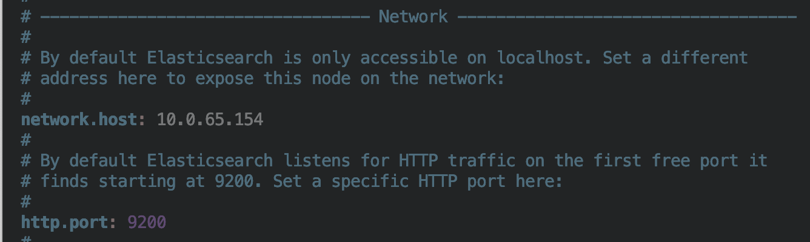
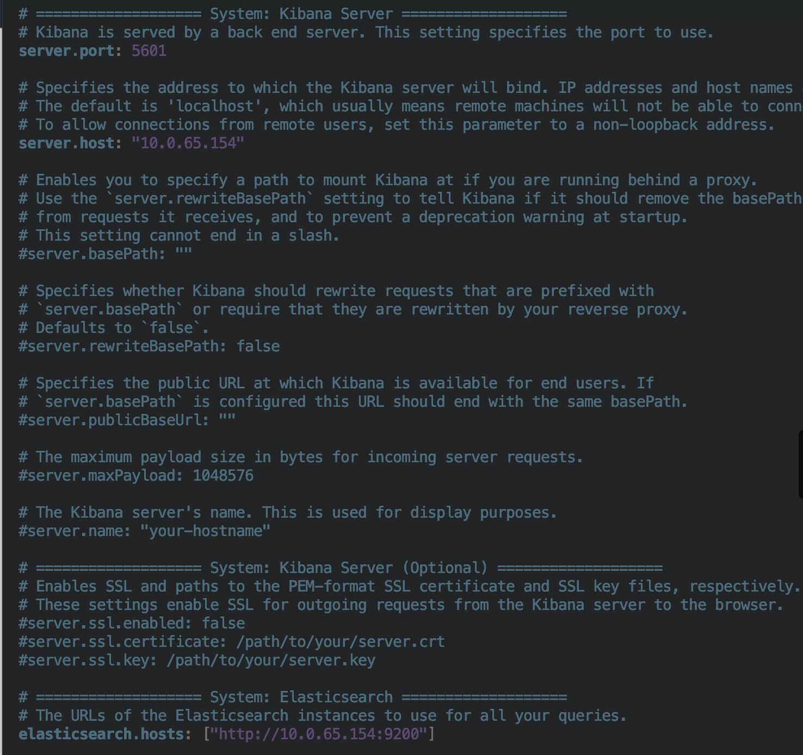

# ELK(ElasticSearch, Logstash, and Kibana) Integration for Chef Automate HA

## Introduction to ELK Stack

ELK Stack is open-source software that allows the search and visualization of logs generated by systems. ELK Stack has 3 primary components.

* **ElasticSearch**: A search engine that stores all collected logs.

* **Logstash**: A data processing component that sends incoming logs to Elasticsearch.

* **Kibana**: A web interface for visualization and searching of logs within Elasticsearch.

* **Filebeat**: Filebeat is used to push logs from Chef Automate HA nodes to Logstash.

Installation of the ELK stack can be done in various ways depending on the organizational needs and requirements. Please refer to this document for details on system requirements and various kinds of installations. As part of this documentation, we have focused on one of the ways of installation.

The Elastic site (https://elastic.co) should be referenced for details on the sizing and configuration of ELK Stack.

## Install Prerequisites

* Dependency: ELK needs Java as a dependency, install the same if not:

      sudo apt-get install openjdk-8-jdk

* Download and install the public signing key:

      wget -qO - https://artifacts.elastic.co/GPG-KEY-elasticsearch | sudo gpg --dearmor -o /usr/share/keyrings/elasticsearch-keyring.gpg

* Installing from the APT repository:

      sudo apt-get install apt-transport-https

* Save the repository definition to /etc/apt/sources.list.d/elastic-8.x.list:

      echo "deb [signed-by=/usr/share/keyrings/elasticsearch-keyring.gpg] https://artifacts.elastic.co/packages/8.x/apt stable main" | sudo tee /etc/apt/sources.list.d/elastic-8.x.list

## ELK Installation

Please follow the below steps to install the elastic stack in the normal way.

### Elasticsearch Installation and Configuration

* Install the Elasticsearch Debian package with:

      sudo apt-get update && sudo apt-get install elastic search

* Configure the elastic settings:

      sudo nano /etc/elasticsearch/elasticsearch.yml

      * Uncomment the Port and add the port number (for example - 9200)
      * uncomment and  the correct "network.host" IP
      * If required, add cluster or "discovery.type: single-node" and node settings.

      

* Start the elastic services:

      sudo systemctl daemon-reload
      sudo systemctl start elasticsearch.service
      sudo systemctl enable elasticsearch.service

For other ways to install elasticsearch; pls follow reference at [Elasticsearch-installation](https://www.elastic.co/guide/en/elasticsearch/reference/current/install-elasticsearch.html)

### Kibana Installation and Configuration:

* To install Kibana run the following:

      apt install kibana
      sudo nano /etc/kibana/kibana.yml --> configure the kibana
      sudo systemctl start kibana.service
      sudo systemctl enable kibana.service

      * Uncomment the Port and add the port number for kibana (for example - 5601)
      * uncomment and add correct "server.host" for kibana
      * uncomment and add correct "network.host" for elasticsearch

    

For other ways to install kibana; pls follow reference at [Kibana-installation](https://www.elastic.co/guide/en/kibana/current/install.html)

### Logstash Installation and Configuration

* To install Logstash run the following:

      apt install logstash
      sudo systemctl start logstash.service
      sudo systemctl enable logstash.service

### Configuration of Logstash

1. Create a configuration file to allow Filebeat to communicate with Logstash.

```sh
sudo nano /etc/logstash/conf.d/chef-beats-input.conf
```

2. Enter the following in the chef-beats-input.conf file to allow Filebeat to send logs to Logstash over TCP port 5044.

```sh
# Read input from filebeat on Chef Automate HA nodes by listening to port 5044 on which filebeat will send the data
input {
beats {
      port => "5044"
}
}

filter {
  #If log line contains 'hab' then we will tag that entry as Chef
  if [message] =~ "hab" {
    grok {
      match => ["message", "^(hab)"]
      add_tag => ["Chef Automate HA"]
    }
  }

}

output {

  stdout {
    codec => rubydebug
  }

  # Send parsed log events to elasticsearch
  elasticsearch {
    hosts => ["localhost:9200"]
  }
}
```

3. Restart the logstash service:

```sh
sudo systemctl restart logstash.service
```

For other ways to install logstash; follow reference at [Logstash Installation](https://www.elastic.co/guide/en/logstash/current/installing-logstash.html) page.
