# ELK Stack (Elasticsearch, Logstash, and Kibana) Integration for Chef Automate HA

## Deploy ELK Stack

ELK Stack is an open-source software that allows the search and visualization of logs generated by systems. ELK Stack has three primary components.

* **Elasticsearch** - A search engine that stores all collected logs.

* **Logstash** - A data processing component that sends incoming logs to Elasticsearch.

* **Kibana** - A web interface for visualization and searching of logs within Elasticsearch.

* **Filebeat** will push logs from Chef Automate HA nodes to Logstash.

The ELK stack can be installed in various ways depending on the organizational needs and requirements. Please refer to this document for details on system requirements and various installations. As part of this documentation, we have focused on one of the installation methods.

The Elastic [site](https://elastic.co) should be referenced for details on the sizing and configuration of ELK Stack.

## ELK stack Installation

Please follow the steps below to install the elastic stack normally.

### Install Prerequisites

1. **Dependency:** ELK needs Java as a dependency; install the same if not:

    ```sh
    sudo apt-get install openjdk-8-jdk
    ```

1. Download and install the public signing key:

    ```sh
    wget -qO - https://artifacts.elastic.co/GPG-KEY-elasticsearch | sudo gpg --dearmor -o /usr/share/keyrings/elasticsearch-keyring.gpg
    ```

1. Installing from the APT repository:

    ```sh
    sudo apt-get install apt-transport-https
    ```

1. Save the repository definition to /etc/apt/sources.list.d/elastic-8.x.list:

    ```sh
    echo "deb [signed-by=/usr/share/keyrings/elasticsearch-keyring.gpg] https://artifacts.elastic.co/packages/8.x/apt stable main" | sudo tee /etc/apt/sources.list.d/elastic-8.x.list
    ```

### Elasticsearch Installation and Configuration

1. Install the Elasticsearch Debian package with:

    ```sh
    sudo apt-get update && sudo apt-get install elasticsearch
    ```

1. Configure the elastic settings:

    ```sh
    sudo nano /etc/elasticsearch/elasticsearch.yml
    ```

    * Uncomment the Port and add the port number (9200).

    * Uncomment and the correct "network.host" IP.

    * If required, add cluster or "discovery.type: single-node" and node settings.

    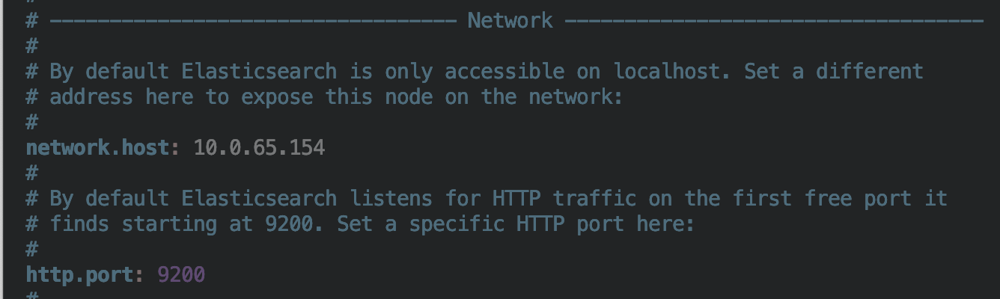

1. Start the elastic services:

    ```sh
    sudo systemctl daemon-reload
    sudo systemctl start elasticsearch.service
    sudo systemctl enable elasticsearch.service
    ```

For other ways to install Elasticsearch; follow the reference at [Elasticsearch-installation](https://www.elastic.co/guide/en/elasticsearch/reference/current/install-elasticsearch.html)

### Kibana Instillation and Configuration

1. To install Kibana run the following:

    ```sh
    apt install kibana
    sudo nano /etc/kibana/kibana.yml --> configure the kibana
    sudo systemctl start kibana.service
    sudo systemctl enable kibana.service
    ```

    * Uncomment the Port and add the port number for Kibana (for example - 5601).

    * Uncomment and add the correct "server.host" for kibana.

    * Uncomment and add the correct "network.host" for Elasticsearch.

    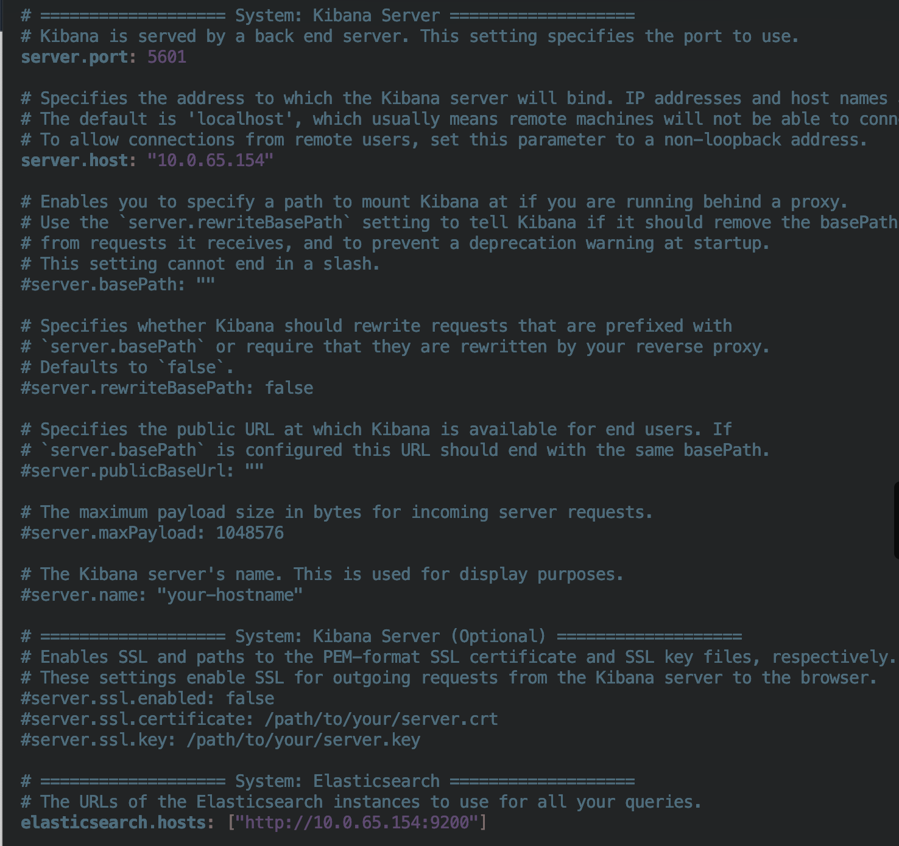

For other ways to install Kibana, please follow the reference at [Kibana-installation](https://www.elastic.co/guide/en/kibana/current/install.html)

### Logstash Installation and Configuration

1. To install Logstash, run the following:

    ```sh
    apt install logstash
    sudo systemctl start logstash.service
    sudo systemctl enable logstash.service
    ```

### Configuration of Logstash

1. Create a configuration file to allow Filebeat to communicate with Logstash.

    ```sh
    sudo nano /etc/logstash/conf.d/chef-beats-input.conf
    ```

1. Enter the following in the `chef-beats-input.conf` file to allow Filebeat to send logs to Logstash over TCP port (5044).

    ```sh
    # Read input from filebeat on Chef Automate HA nodes by listening to port 5044 on which filebeat will send the data
    input {
        beats {
            port => "5044"
        }
    }
    filter {
    #If log line contains 'hab' then we will tag that entry as Chef
        if [message] =~ "hab" {
            grok {
                match => ["message", "^(hab)"]
                add_tag => ["Chef Automate HA"]
            }
        }
    }
    output {
        stdout {
            codec => rubydebug
        }
        # Send parsed log events to elasticsearch
        elasticsearch {
            hosts => ["localhost:9200"]
        }
    }
    ```

1. Restart the logstash service:

    ```sh
    sudo systemctl restart logstash.service
    ```

For other ways to install logstash; please follow the reference at [Logstash-installation](https://www.elastic.co/guide/en/logstash/current/installing-logstash.html)

## Filebeat Installation and Configuration

### Prerequisites

* Deployment and configuration of Logstash, Elasticsearch, and Kibana.

* Chef Automate HA configured with access to Logstash over configure TCP Port (In this configuration TCP 5044).

Steps:

1. Log into each Chef Automate HA node.

1. Run the following to download and extract Filebeat.

```sh
curl -L -O https://artifacts.elastic.co/downloads/beats/filebeat/filebeat-8.8.2-linux-x86_64.tar.gz
tar xzvf filebeat-8.8.2-linux-x86_64.tar.gz
```

## Filebeat Configuration

1. Modify the **filebeat.yml** file.

    ```sh
    sudo nano /etc/filebeat/filebeat.yml
    ```

1. Under the **Filebeat Inputs**, ensure the following is set:

    * `type` is set to *journald*.
    * `id` is set to *everything*.
    * `enable` is set to *true*.

    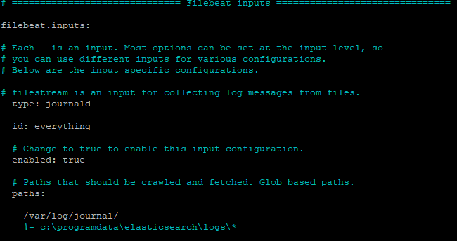

1. Under the **Logstash Outputs**, enter the Logstash host and port to which the logs should be sent.

    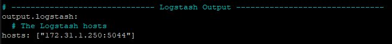

1. Save and close the **filebeat.yml** file.

1. Enable the Filebeat System module by running the following command:

    ```sh
    sudo filebeat modules enable system
    ```

1. Modify the Filebeat module file by running the following command:

    ```sh
    sudo nano /etc/filebeat/modules.d/system.yml
    ```

1. Enable and ensure the path to the log files is correct.

    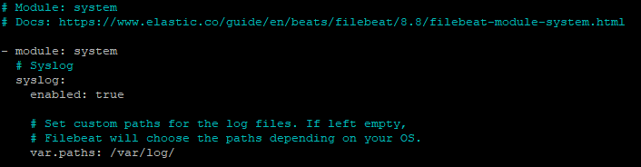

1. Save and close the **system.yml** file.

1. Setup Filebeat ingests pipelines by running the following command:

    ```sh
    sudo filebeat setup --pipelines --modules system
    ```

1. Start and enable Filebeat by running the following command:

    ```sh
    sudo systemctl start filebeat
    ```

    ```sh
    sudo systemctl enable filebeat
    ```

## Visualize Logs in Kibana

1. Open Kibana on Browser using the following steps:

   * Select **Explore on my own**.

    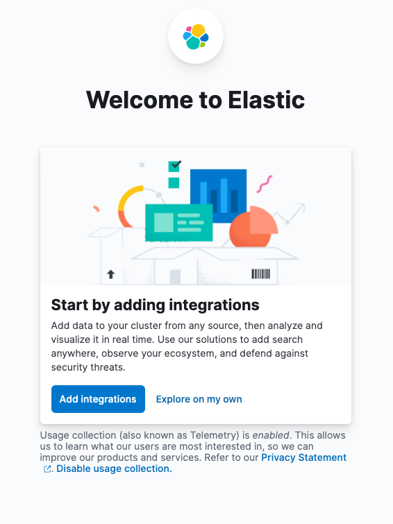

    You will land on the Kibana Home page.

    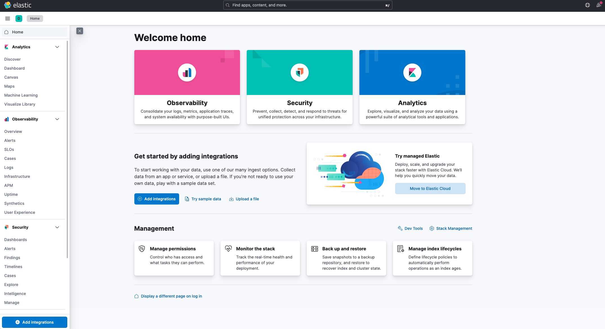

   * Select the **Discover** tab on the left side.

   * 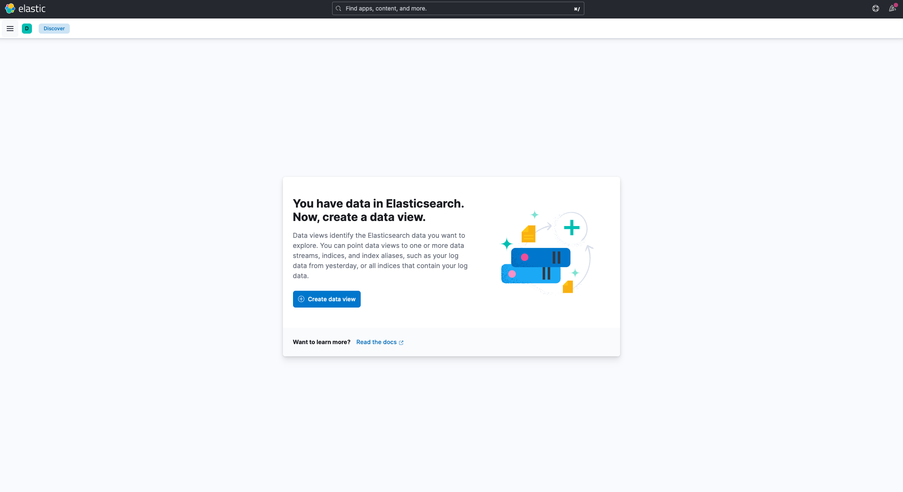

   * Select **Create DataView**.

1. Create an **Index Pattern** in Kibana to view the Logs sent to Logstash.

    

    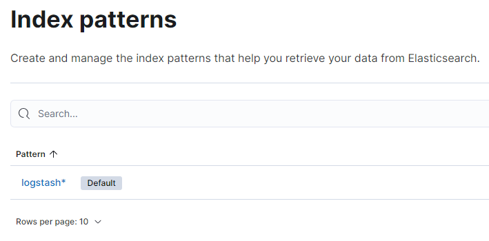

1. In Kibana, navigate to **Analytics/ Discovery** and select the Index Pattern created in the prior step. The logs from the Chef Automate Servers will be displayed.

    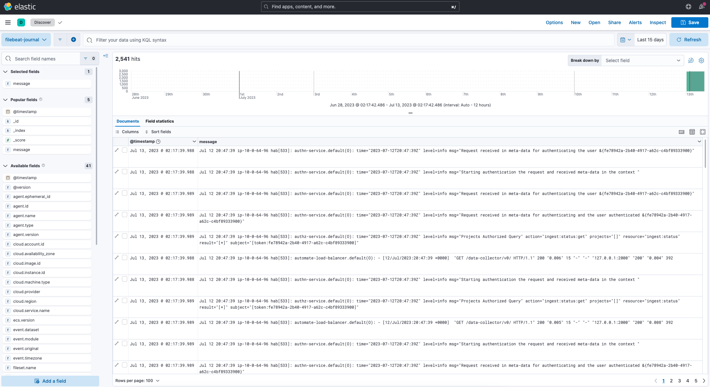

    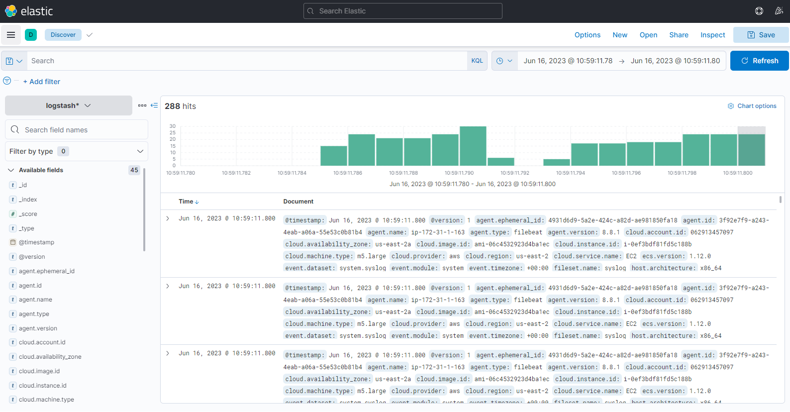

1. We can add multiple filters and customize the data coming.

    We can further build the Automate Service based dashboards for quick looks.

## Custom filtering of Logs at filebeat

In case you want to send only some specific service level logs of Automate and Chef Infra server to our centralized logging server instead of all the logs, this is this section that can be referred.

1. Modify the **filebeat.yml** file.

    ```sh
    sudo nano /etc/filebeat/filebeat.yml
    ```

1. Under the **Filebeat Inputs** add the following processor configuration:

    ```sh
    processors:
        - drop_event:
            when.not.regexp.message: '^<filtered service>'
    ```

As an example:

1. To send only `authn-service` logs to Logstash:

    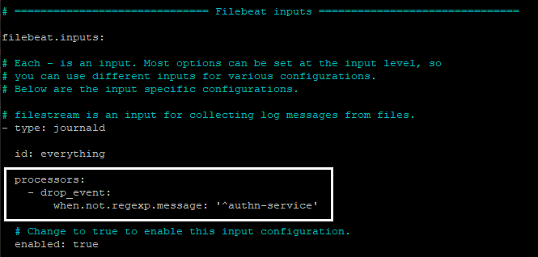

1. To send only `automate-dex` logs to Logstash:

    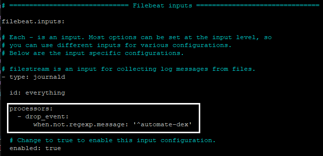

1. In Kibana, navigate to Discover and the filtered results will be visible:

    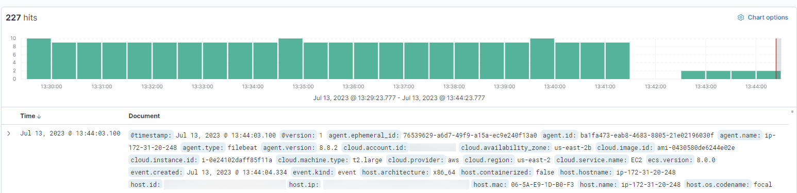

1. Select the logs to confirm the filter is working as expected.

    *authn-service*

    

    *automate-dex*

    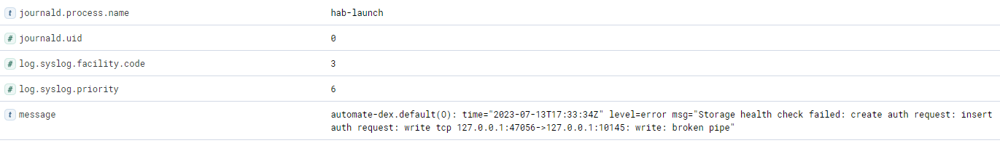
