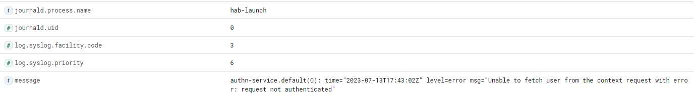

# ELK Stack Integration for Chef Automate HA

## Deploy ELK Stack

ELK Stack is an open-source software which allows search and visualization of logs generated by systems. ELK Stack has 3 primary components.

* **Elasticsearch** - Search engine that stores all collected logs.
* **Logstash** - A data processing component that send incoming logs to Elasticsearch.
* **Kibana** - A web interface for visualization and searching of logs within Elasticsearch.

A fourth component, Filebeat will be used to push logs from Chef Automate HA nodes to Logstash.

This document does not cover the installation and system requirements for ELK Stack due to the many factors that should be considered for this type of deployment (We are providing standard installation ELK stacks below). The Elastic site (https://elastic.co) should be referenced for details on sizing and configuration of ELK Stack.

## ELK stack Installation
Please follow below steps for installing elastic stack in normal way.

### Install Prerequistes

+ Dependency: ELK need java as dependency, install the same if not:

      sudo apt-get install openjdk-8-jdk

+ Download and install the public signing key:

      wget -qO - https://artifacts.elastic.co/GPG-KEY-elasticsearch | sudo gpg --dearmor -o /usr/share/keyrings/elasticsearch-keyring.gpg

+ Installing from the APT repository:

      sudo apt-get install apt-transport-https

+ Save the repository definition to /etc/apt/sources.list.d/elastic-8.x.list:

      echo "deb [signed-by=/usr/share/keyrings/elasticsearch-keyring.gpg] https://artifacts.elastic.co/packages/8.x/apt stable main" | sudo tee /etc/apt/sources.list.d/elastic-8.x.list

### Install Elasticsearch

+ Install the Elasticsearch Debian package with:

      sudo apt-get update && sudo apt-get install elasticsearch

+ configure the elastic settings:

      sudo nano /etc/elasticsearch/elasticsearch.yml

    + uncomment the Port and add the port number (for example - 9200)
    + uncomment and add correct "network.host" IP
    + If required, add cluster or "discovery.type: single-node" and node settings.

+ Start the elastic services:

      sudo systemctl daemon-reload
      sudo systemctl start elasticsearch.service
      sudo systemctl enable elasticsearch.service

### Install Kibana

+ To install Kibana run the following:

      apt install kibana
      sudo nano /etc/kibana/kibana.yml --> configure the kibana
      sudo systemctl start kibana.service
      sudo systemctl enable kibana.service

    + uncomment the Port and add the port number for kibana (for example - 5601)
    + uncomment and add correct "server.host" for kibana
    + uncomment and add correct "network.host" for elasticsearch

### Install Logstash

+ To install Logstash run the following:

      apt install logstash
      sudo systemctl start logstash.service
      sudo systemctl enable logstash.service

Please follow below setups for logstash and filebeat setup.

### Prerequisites

* Deployment and configuration of Logstash, Elasticsearch and Kibana.
* Chef Automate HA configured with access to Logstash over configure TCP Port (In this configuration TCP 5044)

### Configuration of Logstash

1. Create a configuration file to allow Filebeat to communicate with Logstash.

```
sudo nano /etc/logstash/conf.d/chef-beats-input.conf
```
2. Enter the following in the chef-beats-input.conf file to allow Filebeat to send logs to Logstash over TCP port 5044.

```
# Read input from filebeat on Chef Automate HA nodes by listening to port 5044 on which filebeat will send the data
input {
    beats {
        port => "5044"
    }
}

filter {
  #If log line contains 'hab' then we will tag that entry as Chef
  if [message] =~ "hab" {
    grok {
      match => ["message", "^(hab)"]
      add_tag => ["Chef Automate HA"]
    }
  }

}

output {

  stdout {
    codec => rubydebug
  }

  # Send parsed log events to elasticsearch
  elasticsearch {
    hosts => ["localhost:9200"]
  }
}
```

## Filebeat Installation

1. Log into each Chef Automate HA node
2. Run the following to download and extract Filebeat
```
sudo curl -L -O https://artifacts.elastic.co/downloads/beats/filebeat/filebeat-8.8.1-linux-x86_64.tar.gz

sudo tar xzvf filebeat-8.8.1-linux-x86_64.tar.gz
```

## Filebeat Configuration

1. Modify the **filebeat.yml** file.

```
sudo nano /etc/filebeat/filebeat.yml
```
2. Under the **Filebeat Inputs** ensure the following is set:

- type is set to journald
- id is set to everything
- enable is set to true.


3. Under the **Logstash Outputs**, enter the Logstash host and port to which the logs should be sent.

 

4. Save and close **filebeat.yml**

5. Enable the Filebeat System module

```
sudo filebeat modules enable system
```
6. Modify the Filebeat module file

```
sudo nano /etc/filebeat/modules.d/system.yml
```
7. Enable and ensure the path to the log files are correct.


8. Save and close **system.yml**

9. Setup Filebeat ingest pipelines by running the following command

```
sudo filebeat setup --pipelines --modules system
```
10. Start and enable Filebeat

```
sudo systemctl start filebeat
```
```
sudo systemctl enable filebeat
```


## Visualize Logs in Kibana

1. Open kibana on browser:
   + Click on **Explore on my own**.
     

     You will land on Kibana Home page.

     
   + Click on **Dicover** tab on left side.
   + 
   + Click on **Create DataView**.

2. Create an **Index Pattern** in Kibana to view the Logs sent to Logstash.


3. In Kibana, navigate to **Analytics/ Discovery** and select the Index Pattern created in the prior step. The logs from the Chef Automate Servers will be displayed.


+ We can add multiple filters and customise the data comming.

We can further build the Automate Service based dashboards for quick looks.

## Filter Logs from within Filebeat

1. Modify the **filebeat.yml** file.

```
sudo nano /etc/filebeat/filebeat.yml
```
2. Under the **Filebeat Inputs** add the following processor configuration:

```
 processors:
    - drop_event:
        when.not.regexp.message: '^<filtered service>'
```

As an example:

To send only authn-service logs to Logstash:


To send only automate-dex logs to Logstash:


3. In Kibana, navigate to Discover and the filtered results will be visable:


4. Click into the logs to confirm the filter is working as expected.

authn-service


automate-dex
