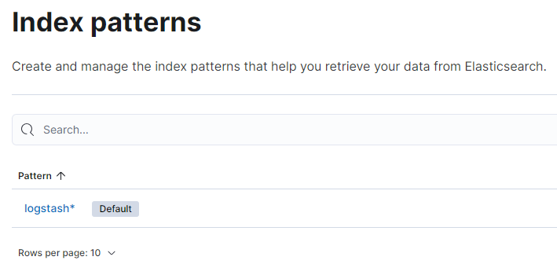

# Filebeat Installation and Configuration

## Prerequisites

* Deployment and configuration of Logstash, Elasticsearch, and Kibana.

* Chef Automate HA configured with access to Logstash over configured TCP Port (In this configuration, TCP 5044).

The steps are as shown below:

1. Log in to each Chef Automate HA node.

1. Run the following command to download and extract Filebeat.

```sh
curl -L -O https://artifacts.elastic.co/downloads/beats/filebeat/filebeat-8.8.2-linux-x86_64.tar.gz
tar xzvf filebeat-8.8.2-linux-x86_64.tar.gz
```

## Filebeat Configuration

1. Modify the **filebeat.yml** file.

   ```sh
   sudo nano /etc/filebeat/filebeat.yml
   ```

1. Under the **Filebeat Inputs**, ensure the following is set:

   * type is set to `journald`.
   * `id` is set to everything.
   * `enable` is set to **true**.

   

1. Under the **Logstash Outputs**, enter the Logstash host and port to which the logs should be sent.

   

1. Save and close the **filebeat.yml** file.

1. Enable the Filebeat System module

   ```sh
   sudo filebeat modules enable system
   ```

1. Modify the Filebeat module file.

   ```sh
   sudo nano /etc/filebeat/modules.d/system.yml
   ```

1. Enable and ensure the path to the log files is correct.

   

1. Save and close the **system.yml** file.

1. Setup Filebeat ingest pipelines by running the following command:

   ```sh
   sudo filebeat setup --pipelines --modules system
   ```

1. Start and enable Filebeat by running the following commands:

   ```sh
   sudo systemctl start filebeat
   ```

   ```sh
   sudo systemctl enable filebeat
   ```

## Visualize Logs in Kibana

1. Open Kibana on browser:

   * Select on **Explore on my own**.

     

     You will land on the Kibana Home page.

     

   * Select **Dicover** tab on left side.

   * 

   * Select **Create DataView**.

1. Create an **Index Pattern** in Kibana to view the Logs sent to Logstash.

   

   

1. In Kibana, navigate to **Analytics/ Discovery** and select the Index Pattern created in the prior step. The logs from the Chef Automate Servers will be displayed.

   

   

* We can add multiple filters and customize the data coming.

We can further build the Automate Service-based dashboards for quick looks.

## Custom filtering of Logs at filebeat

**Description:** In case we would like to send only some specific service level logs of the Automate and Chef Infra server to our centralized logging server instead of all the logs, this section can be referred to.

1. Modify the **filebeat.yml** file.

   ```sh
   sudo nano /etc/filebeat/filebeat.yml
   ```

1. Under the **Filebeat Inputs**, add the following processor configuration:

   ```sh
   processors:
      - drop_event:
         when.not.regexp.message: '^<filtered service>'
   ```

   As an example:

   To send only authn-service logs to Logstash:

   

   To send only automate-dex logs to Logstash:

   

1. In Kibana, navigate to Discover, and the filtered results will be visible:

   

1. Select the logs to confirm the filter is working as expected.

   *authn-service*

   

   *automate-dex*

   
