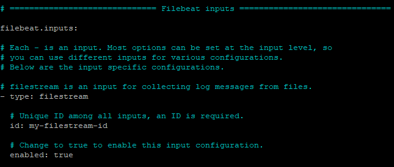
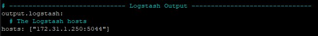
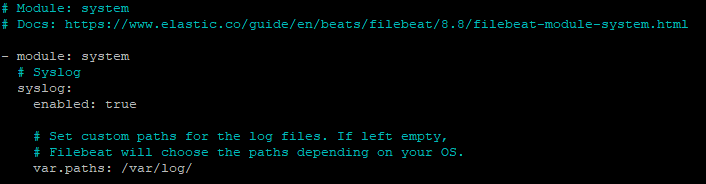
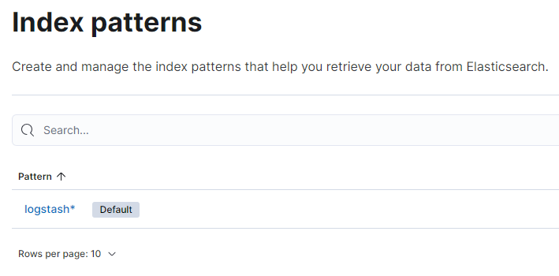
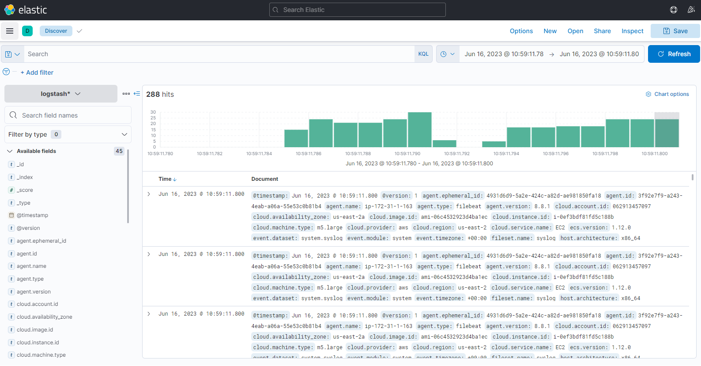

# ELK Stack Integration for Chef Automate HA

## Deploy ELK Stack

ELK Stack is an open-source software which allows search and visualization of logs generated by systems. ELK Stack has 3 primary components.

* **Elasticsearch** - Search engine that stores all collected logs.
* **Logstash** - A data processing component that send incoming logs to Elasticsearch.
* **Kibana** - A web interface for visualization and searching of logs within Elasticsearch.

A fourth component, Filebeat will be used to push logs from Chef Automate HA nodes to Logstash.

This document does not cover the installation and system requirements for ELK Stack due to the many factors that should be considered for this type of deployment. The Elastic site (https://elastic.co) should be referenced for details on sizing and configuration of ELK Stack.

## Prerequisites

* Deployment and configuration of Logstash, Elasticsearch and Kibana.
* Chef Automate HA configured with access to Logstash over configure TCP Port (In this configuration TCP 5044)

## LogStash Configuration

1. Create a configuration file to allow Filebeat to communicate with Logstash.

```
sudo nano /etc/logstash/conf.d/chef-beats-input.conf
```
2. Enter the following in the chef-beats-input.conf file to allow Filebeat to send logs to Logstash over TCP port 5044.

```
# Read input from filebeat on Chef Automate HA nodes by listening to port 5044 on which filebeat will send the data
input {
    beats {
        port => "5044"
    }
}

filter {
  #If log line contains 'hab' then we will tag that entry as Chef
  if [message] =~ "hab" {
    grok {
      match => ["message", "^(hab)"]
      add_tag => ["Chef Automate HA"]
    }
  }

}

output {

  stdout {
    codec => rubydebug
  }

  # Send parsed log events to elasticsearch
  elasticsearch {
    hosts => ["localhost:9200"]
  }
}
```

## Filebeat Installation

1. Log into each Chef Automate HA node
2. Run the following to download and extract Filebeat
```
sudo curl -L -O https://artifacts.elastic.co/downloads/beats/filebeat/filebeat-8.8.1-linux-x86_64.tar.gz

sudo tar xzvf filebeat-8.8.1-linux-x86_64.tar.gz
```

## Filebeat Configuration

1. Modify the **filebeat.yml** file.

```
sudo nano /etc/filebeat/filebeat.yml
```
2. Under the **Filebeat Inputs** ensure enabled is set to true.



3. Under the **Logstash Outputs**, enter the Logstash host and port to which the logs should be sent.

 

4. Save and close **filebeat.yml**

5. Enable the Filebeat System module

```
sudo filebeat module enable system
```
6. Modify the Filebeat module file

```
sudo nano /etc/filebeat/modules.d/system.yml
```
7. Enable and ensure the path to the log files are correct.



8. Save and close **system.yml**

9. Setup Filebeat ingest pipelines by running the following command

```
sudo filebeat setup --pipelines --modules system
```
10. Start and enable Filebeat

```
sudo systemctl start filebeat
```
```
sudo systemctl enable filebeat
```

## Visualize Logs in Kibana

1. Create an **Index Pattern** in Kibana to view the Logs sent to Logstash.



2. In Kibana, navigate to **Analytics/ Discovery** and select the Index Pattern created in the prior step. The logs from the Chef Automate Servers will be displayed.




