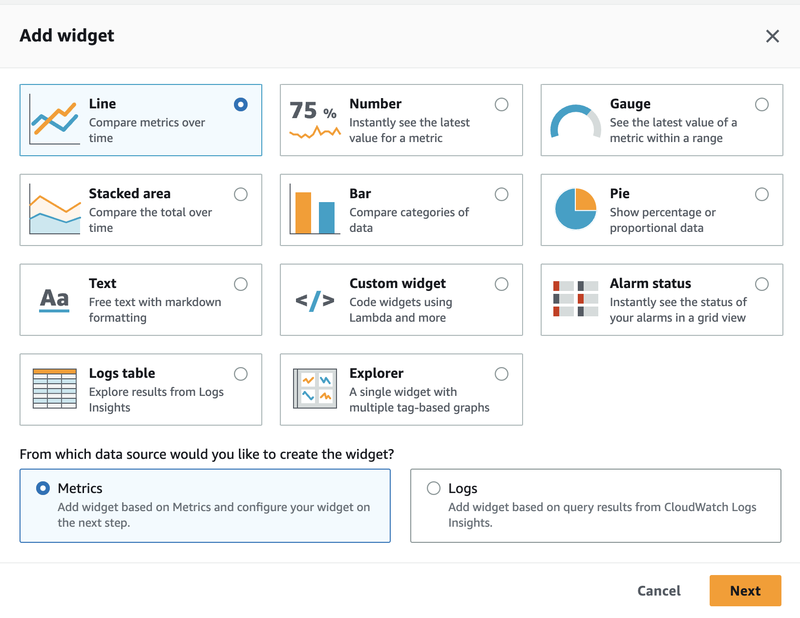
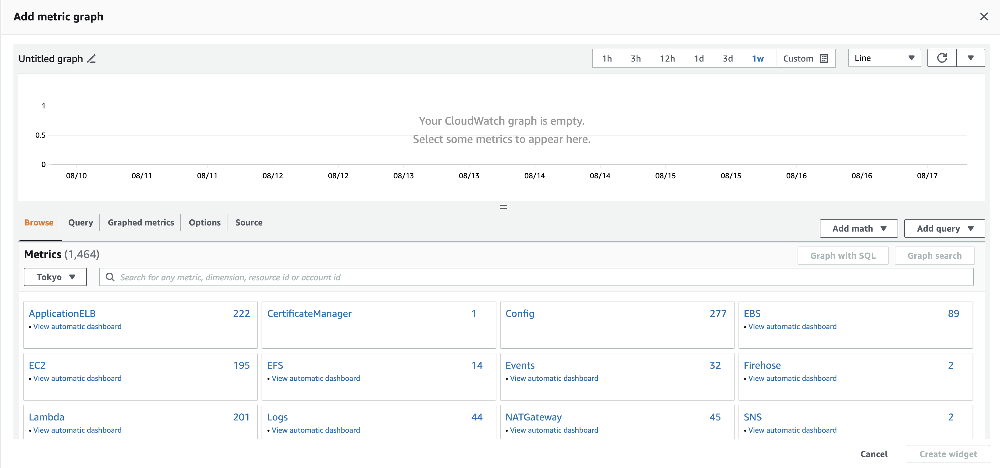
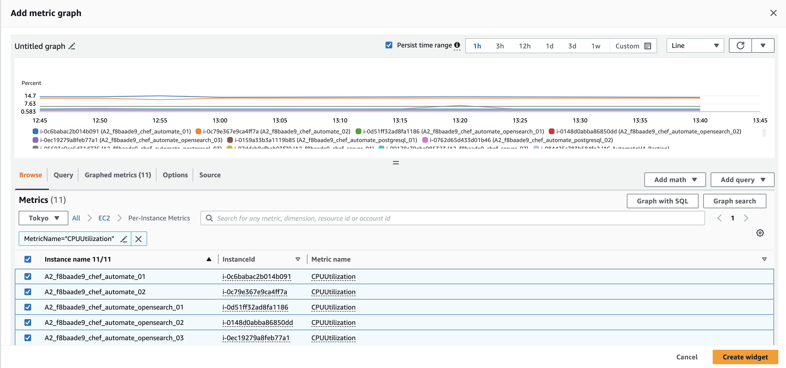
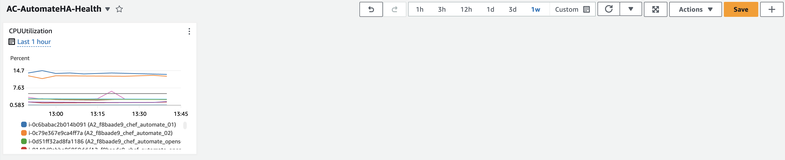
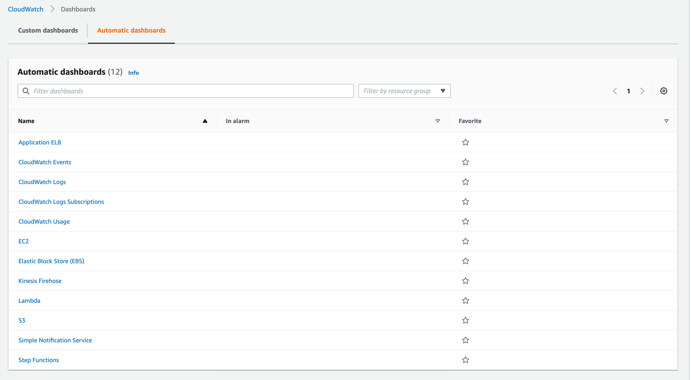
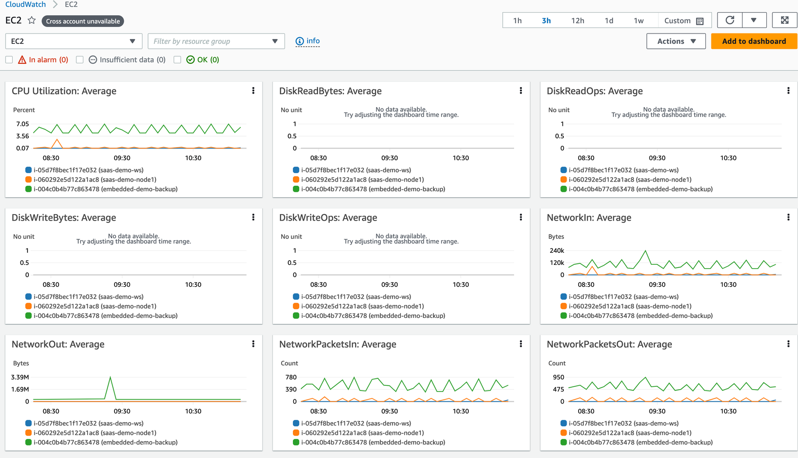

# AutomateHA cluster metrics monitoring Dashboard create in Amazon CloudWatch

### Description:
As an Automate HA cluster user, It is needed to set up an AWS CloudWatch dashboard to monitor the health of various components of Automate HA along with the overall health and service-related stats visible in one place.

#### AWS CloudWatch Dashboard:
* Amazon CloudWatch dashboards are customizable home pages in the CloudWatch console that you can use to monitor your resources in a single view, even those resources that are spread across different Regions. You can use CloudWatch dashboards to create customized views of the metrics and alarms for your AWS resources.

* With dashboards, you can create the following:
  * A single view for selected metrics and alarms to help you assess the health of your resources and applications across one or more Regions. You can select the color used for each metric on each graph so that you can easily track the same metric across multiple graphs.
  * An operational playbook that provides guidance for team members during operational events about how to respond to specific incidents.
  * A common view of critical resource and application measurements that can be shared by team members for faster communication flow during operational events.
* Ref: [Using Amazon CloudWatch dashboards](https://docs.aws.amazon.com/AmazonCloudWatch/latest/monitoring/CloudWatch_Dashboards.html)

**AWS CloudWatch dashboard and widget collections are to be set up on AutomateHA cluster:**
* System metrics
* Infrastructure health
* Service level health
* Postgres metrics
* OpenSearch metrics

#### Dashboard configuration setup:
To get started, create a CloudWatch dashboard. You can create multiple dashboards, and you can add dashboards to a favorites list. You aren't limited to the number of dashboards that you can have in your AWS account. All dashboards are global. Refer [here](https://docs.aws.amazon.com/AmazonCloudWatch/latest/monitoring/create_dashboard.html) for more details.

1. Open the CloudWatch console.
2. In the navigation pane, choose **Dashboards**, and then choose **Create dashboard**.
3. In the Create new dashboard dialog box, enter a name for the dashboard, and then choose Create dashboard.
4. Select source - *Metrics* or *Logs* on which the dashboard widget to create.
   
5. Choose metrics graph for the Metrics source dashboard selected on step 4.
   
6. Choose **Add widget**, and then repeat step 4 to add another widget to the dashboard. You can repeat this step multiple times.
   
7. Choose **Save dashboard**.
   

Refer [here](https://docs.aws.amazon.com/AmazonCloudWatch/latest/monitoring/create_dashboard.html) for more details.

**Note:** Refer to [Logs and metrics supported by Amazon CloudWatch Application Insights](https://docs.aws.amazon.com/AmazonCloudWatch/latest/monitoring/appinsights-logs-and-metrics.html) for list of metrics can be configured.

#### Automatic Amazon CloudWatch Dashboards
AWS CloudWatch provide already available dashboard on the resources.

We can use the above dashboard or create more incline to AutomateHA cluster as per need with above explained steps.