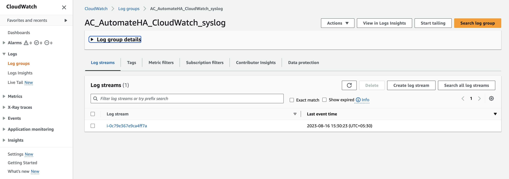
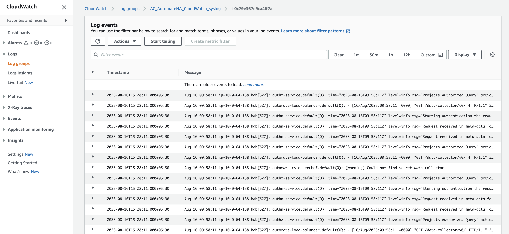

# AWS CloudWatch centralized monitoring at the Automate HA cluster

## Description

As an Automate HA customer, I need to set monitoring rules for the available metrics on the AWS Cloudwatch console. These metrics can be used to track and notify me about Automate HA infrastructure-related health.

## Send centralized Automate HA instance logs to AWS CloudWatch

Amazon CloudWatch is a monitoring service for AWS cloud resources and the applications you run on AWS. You can use Amazon CloudWatch to collect and track metrics, collect and monitor log files, set alarms, and automatically react to changes in your AWS resources. You can use Amazon CloudWatch to gain system-wide visibility into resource utilization, application performance, and operational health.

### Configuration for sending centralized logs to CloudWatch involves

1. Install the CloudWatch agent in the instance.
1. Prepare the configuration file in the instance.
1. Start the CloudWatch agent service in the instance.
1. Monitor the logs using the CloudWatch web console.

## Install and configure the CloudWatch Logs agent on an existing Amazon EC2 instance

1. Connect to your Automate HA Bastion Host.

1. Navigate to a respective instance.

1. Install the awslogs agent.

    wget https://s3.amazonaws.com/aws-cloudwatch/downloads/latest/awslogs-agent-setup.py

    ```sh
    sudo python ./awslogs-agent-setup.py --region <aws-region>
    ```

    **Note:** To send the log data from instances to CloudWatch. There are two methods: creating separate IAM roles specific to CloudWatch and attaching the cases to the same IAM roles and policies. Another is adding the IAM user keys during the aswlogs agent installation at the /etc/awslogs/awslogs.conf file. For this documentation, we are choosing the second method. You can refer to the IAM roles creation method at the [reference link](https://docs.aws.amazon.com/AmazonCloudWatch/latest/monitoring/create-iam-roles-for-cloudwatch-agent.html).

1. Setup the /etc/awslogs/awslogs.conf file to configure the logs to track. For more information about editing this file, see the [CloudWatch Logs agent reference](https://docs.aws.amazon.com/AmazonCloudWatch/latest/logs/AgentReference.html). To set this file, just follow the auto prompts that come when awslogs is installed. See the screenshot below for reference.

    

1. Start the awslogs service. (By default, the starting of service is taken care of by the installation script)

    ```sh
    sudo systemctl start awslogs
    sudo systemctl enable awslogs
    ```

1. After the agent has been running for a few moments, you should see the newly created log group and log stream in the CloudWatch console.

1. Log in to the AWS console open CloudWatch and navigate to the Logs tab.

    

1. Open the Log group to see the log stream segregated by set name (For example, the instance name here).

   

1. Open the respective instance log stream to see the centralized Automate HA service logs.

    

We can further create visualizations and filter logs as per requirements and set the appropriate alerts on the threshold logs, similar to [Automate HA CloudWatch metrics monitoring](/cloud-watch/AWS_CloudWatch_Metrics_Monitoring_Configration.md).

Using the above log visualized metrics, we can further create the Amazon CloudWatch Dashboards per business needs.
