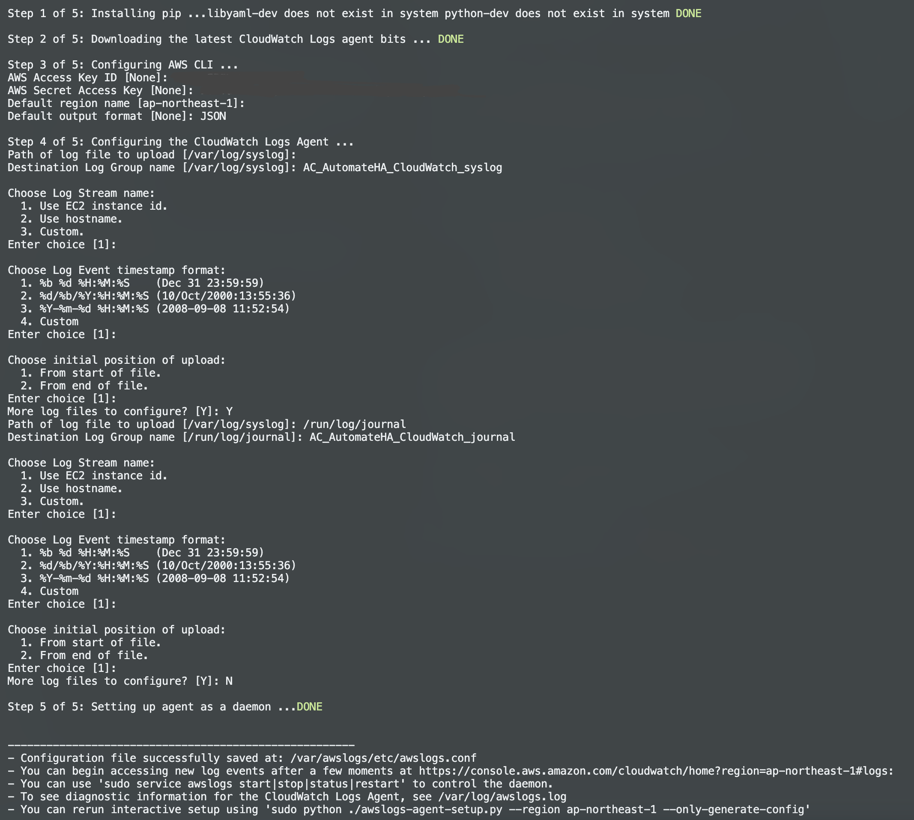

# AWS CloudWatch centralized monitoring at Automate HA cluster

## Description

As an Automate HA customer, I need to have monitoring rules set for the available metrics on the AWS Cloudwatch console which can be used for tracking and getting notified for Automate HA infrastructure-related health.

## Send centralized Automate HA instances logs to AWS CloudWatch

Amazon CloudWatch is a monitoring service for AWS cloud resources and the applications you run on AWS. You can use Amazon CloudWatch to collect and track metrics, collect and monitor log files, set alarms, and automatically react to changes in your AWS resources. You can use Amazon CloudWatch to gain system-wide visibility into resource utilization, application performance, and operational health.

### Configuration for sending centralized logs to CloudWatch involves

1. Install the CloudWatch agent in the instance.
1. Prepare the configuration file in the instance.
1. Start the CloudWatch agent service in the instance.
1. Monitor the logs using CloudWatch web console.

## Install and configure CloudWatch Logs agent on an existing Amazon EC2 instance

1. Connect to your Automate HA Bastion Host.

1. Navigate to respective instance.

1. Install the awslogs agent.

    wget https://s3.amazonaws.com/aws-cloudwatch/downloads/latest/awslogs-agent-setup.py

    ```sh
    sudo python ./awslogs-agent-setup.py --region <aws-region>
    ```

    **Note:** To send the logs data from instances to CloudWatch. There are two methods, one is creating separate IAM role specific to cloudwatch and than attach the instances to same IAM roles and policies. And another is adding the IAM user keys at the time of aswlogs agent installation at the /etc/awslogs/awslogs.conf file. For this documentation we are choosing the second method. You can refer to IAM roles creation method at [reference link](https://docs.aws.amazon.com/AmazonCloudWatch/latest/monitoring/create-iam-roles-for-cloudwatch-agent.html).

1. Setup the /etc/awslogs/awslogs.conf file to configure the logs to track. For more information about editing this file, see [CloudWatch Logs agent reference](https://docs.aws.amazon.com/AmazonCloudWatch/latest/logs/AgentReference.html). To set this file, just follow the auto prompts comes at time of awslogs installation. see below screenshot for reference.

    

1. Start the awslogs service. (By default the starting of service is taken care by the installation script)

    ```sh
    sudo systemctl start awslogs
    sudo systemctl enable awslogs
    ```

1. You should see the newly created log group and log stream in the CloudWatch console after the agent has been running for a few moments.

1. Login to AWS console and open CloudWatch and navigate to Logs tab.

    

1. Open the Log group to see log stream segregated by set name (For example instance name here).

   

1. Open the respective instance log stream to see the centralized Automate HA service logs.

    

We can further create visualization and filter on logs as per requirements and set the appropriate alerts on the threshold logs as similar to [Automate HA CloudWatch metrics monitoring](/cloud-watch/AWS_CloudWatch_Metrics_Monitoring_Configration.md).

We can further create the Amazon CloudWatch Dashboards as per business need on the above log visualized metrics.
