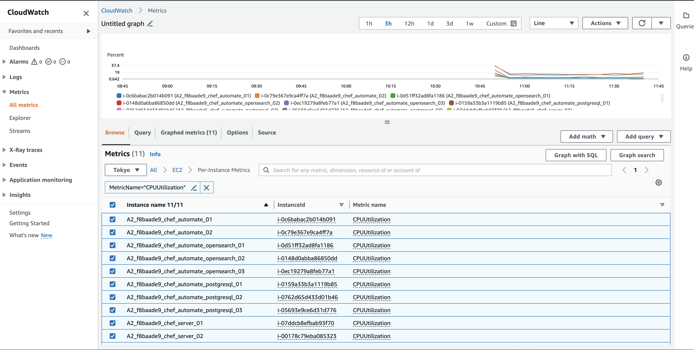
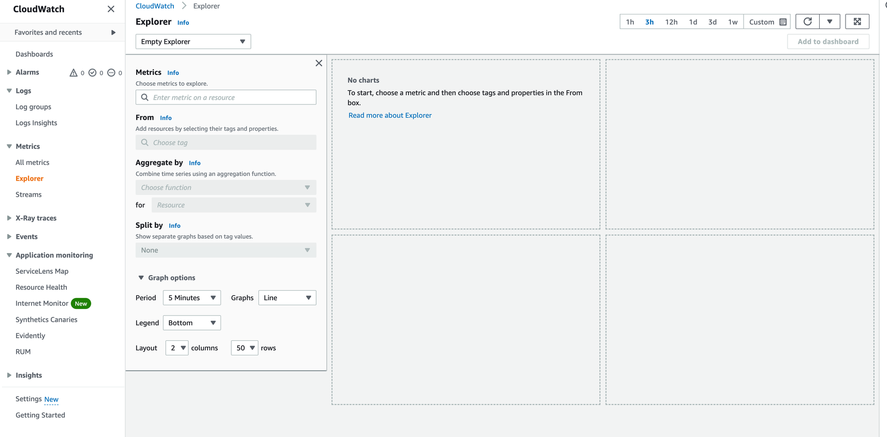
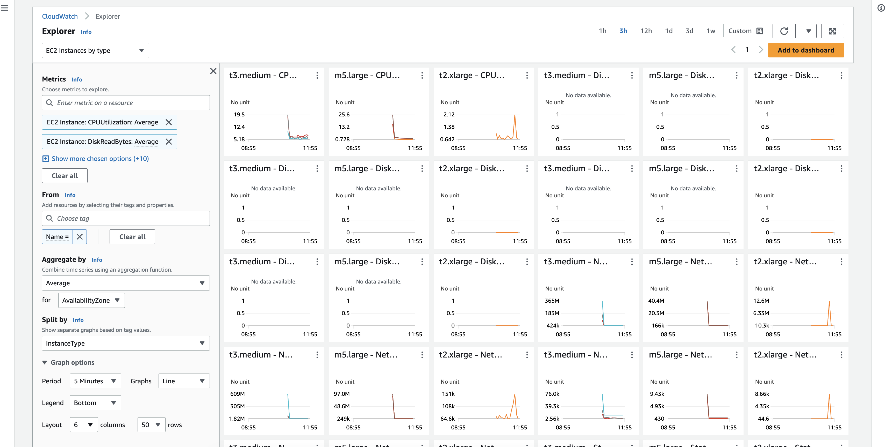
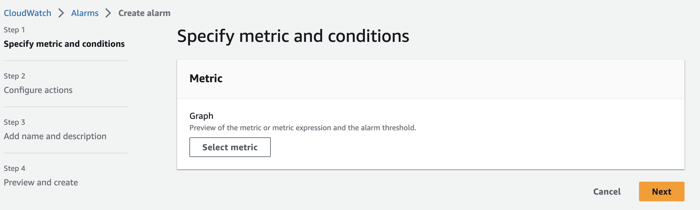
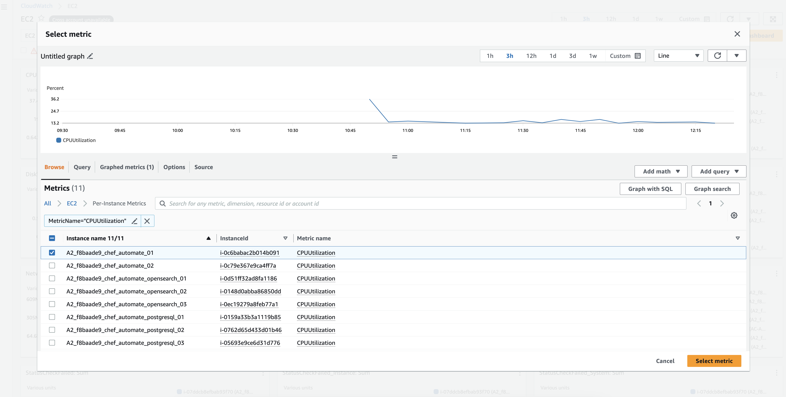
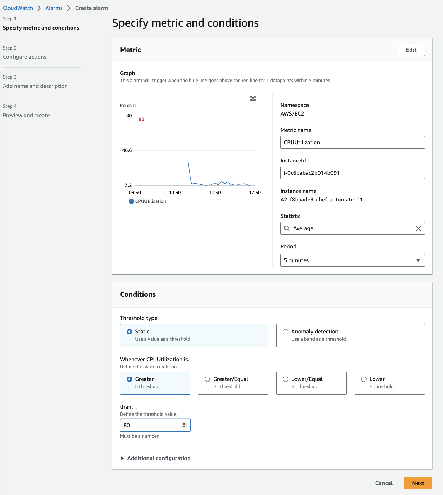
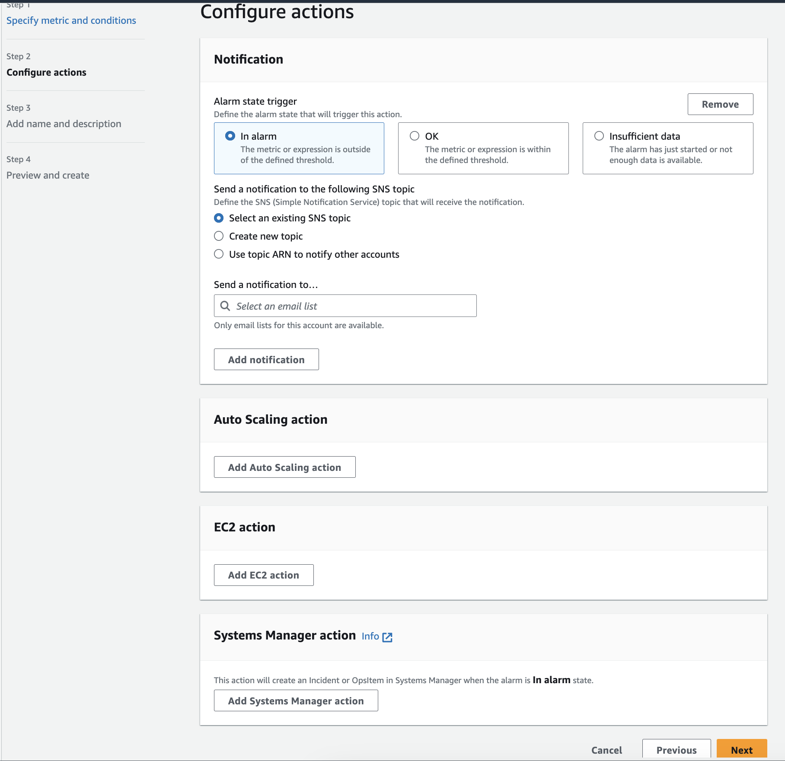
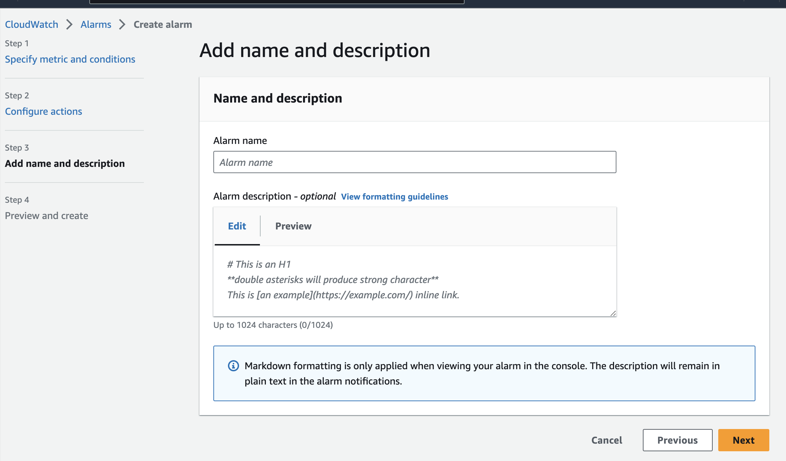

# Automate HA cluster configuration and Monitoring rules setup with AWS CloudWatch Metrics Monitor

## Description

As an Automate HA user, you need to set monitoring rules for the available metrics on the AWS CloudWatch console, which can be used to track and notify you about Automate HA infrastructure-related health.
Automate HA customers who have chosen the AWS deployment mechanism can select this option for metrics and monitoring as part of their AWS CloudWatch usage.

### AWS CloudWatch metrics monitor to be set up for

1. Automate and chef server application-level services

1. Managed OpenSearch and Managed PostgreSQL metrics

1. Bastion node

1. System and Disk level usage and performance level metrics

### AWS CloudWatch Monitoring

1. Amazon CloudWatch monitors your Amazon Web Services (AWS) resources and the applications you run on AWS in real time. You can use CloudWatch to collect and track metrics, variables you can measure for your resources and applications.

1. The CloudWatch home page automatically displays metrics about every AWS service you use. You can also create custom dashboards to display metrics about your custom applications and display custom collections of metrics you choose.

1. With AWS, there are already existing default monitoring metrics available, and guided steps to reach out are defined here [Basic monitoring and detailed monitoring Amazon CloudWatch](https://docs.aws.amazon.com/AmazonCloudWatch/latest/monitoring/cloudwatch-metrics-basic-detailed.html). CloudWatch provides two categories of monitoring: *basic monitoring and detailed monitoring.*

1. Basic monitoring is the default active feature for the Amazon EC2 instances for Automate HA Cluster to publish a default set of metrics to CloudWatch without charging customers.

1. Detailed monitoring provides more frequent metrics, published at one-minute intervals instead of the five-minute intervals used in Amazon EC2 essential monitoring; you must choose to activate it.  [Enable or turn off detailed monitoring for your instances](https://docs.aws.amazon.com/AWSEC2/latest/UserGuide/using-cloudwatch-new.html)

### CloudWatch Metrics Monitoring

**Note:** We use essential monitoring tools like Amazon CloudWatch, which provides adequate metrics for Automate HA cluster monitoring. However, depending on needs, one can explore Amazon CloudWatch's more detailed real-time monitoring features.

1. Login to Amazon CloudWatch Console.

1. Navigate to the Metrics section from the left side menu.

    

1. Open the required metrics you want to see, for example, *EC2* metrics. Select the metric stream.

    

    * You can also choose for *automatic pre-build CloudWatch Dashboard* for particular metrics.

        

1. Select or filter the Automate HA cluster instance or metrics you want to check.

   

We can further add many more filters and queries to gain the visualization or metrics as per business needs - [Use Amazon CloudWatch metrics](https://docs.aws.amazon.com/AmazonCloudWatch/latest/monitoring/working_with_metrics.html)

### Automate HA cluster Metrics monitoring setup

Use Metrics Explorer to monitor Automated HA cluster resources by their tags and properties. Metrics Explorer is a tag-based tool that enables you to filter, aggregate, and visualize your metrics by tags and resource properties to enhance service observability.

1. Open the CloudWatch console.

1. In the navigation panel, choose Explorer.

1. Do one of the following:

   * To use a template, select it in the box that currently shows Empty Explorer.
        Depending on the template, the explorer might immediately display metrics graphs. If it doesn't, choose one or more tags or properties in the From box, and then data should appear. If it doesn't, use the options at the top of the page to display a longer time range in the graphs.

   * To create a custom visualization, under Metrics, choose a single metric or all the available metrics from a service. After you choose a metric, you can optionally repeat this step to add more metrics.

    

1. Choose the respective metrics as business needs. For example, see the below screenshot, where

   

1. To add this visualization as a widget to a CloudWatch dashboard, choose **Add to Dashboard**.

To know more about the detailed configuration, see the [CloudWatch Metrics Explorer](https://docs.aws.amazon.com/AmazonCloudWatch/latest/monitoring/CloudWatch-Metrics-Explorer.html) page.

## Monitoring rules for Automate HA

Based on the above-mentioned steps to create a metrics monitor for Amazon CloudWatch, we can set up monitoring rules for Automate HA based on the metrics received at Amazon CloudWatch.

1. Here is the list of monitoring rules and logical conditions and details to be referenced for monitor creation: [Monitoring rule list](./Monitoring_rule_list.md)

1. Refer to [Logs and metrics supported by Amazon CloudWatch Application Insights](https://docs.aws.amazon.com/AmazonCloudWatch/latest/monitoring/appinsights-logs-and-metrics.html) for a list of metrics that can be configured.
To set the monitoring rules, we use Amazon SNS, which allows applications to send time-critical messages to multiple subscribers through a "push" mechanism against the AMS Managed Monitoring System or MMS, Amazon SNS (SNS) topic that the alarms are published to; in this case, MMS and your SQS queues. You can use CloudWatch to create custom metrics and, through an SNS topic, have AMS alarm you appropriately. Refer to [Setting up Amazon SNS notifications](https://docs.aws.amazon.com/AmazonCloudWatch/latest/monitoring/US_SetupSNS.html).

1. **Detection Method:** Select a detection method per the above options.

1. **Metrics check:** Select the metrics we want to set the monitor as part of the rule definition.

1. **Monitor scope:** Select the environment and necessary tags as part of the rule definition.

1. **Aggregate by and Graph option** Add the arithmetic logic on the duration. This check should verify the threshold.

In a nutshell, the parameters below are required to monitor the Automate HA cluster.

1. **Service:** for which service monitors exist, like PostgreSQL, OpenSearch, Application services, etc.

1. **Alert Name:** Name of the alert to be shown.

1. **Check rules:** Metrics to be used and rule added for threshold.

1. **Severity:** The issue's priority depends on which appropriate alert action and type are chosen.

1. **Evaluation duration:** Duration on which it will be evaluated.

1. **Alert type:** Slack, Email, Outlook, PagerDuty to be selected.

### Steps to configure Amazon CloudWatch Alarm using Amazon SNS

1. Open the CloudWatch console.

1. In the navigation pane, choose Alarms, All alarms.

1. Choose Create Alarm.

1. Choose Select Metric.

   

1. Do one of the following:

   * Choose the service namespace that contains the metric that you want. Continue choosing options as they appear to narrow the choices. When a list of metrics appears, select the check box next to your desired metric.

   * In the search box, enter the name of a metric, account ID, account label, dimension, or resource ID. Then, choose one of the results and continue until a list of metrics appears. Select the check box next to the metric that you want and Choose **Select metric**.

    

1. Specify metrics conditions:

   * Whenever the metric is greater than, less than, or equal to the threshold, specify whether the metric must be greater than, less than, or equal. Under that, **specify the threshold value**.

   

1. Configure Action:

   * Under Notification, select an SNS topic to notify when the alarm is triggered.

   * Select the appropriate auto action. To have the alarm perform Auto Scaling, EC2, or Systems Manager actions, choose the appropriate button and the alarm state and action to perform.

   

1. Enter the name and description of the alarm and choose **Next**.

   

1. Under **Preview and Create**, confirm the information and conditions you want, then choose **Create alarm**.

For a detailed view of Amazon CloudWatch Alarm, see the [Alarm That Sends Email](https://docs.aws.amazon.com/AmazonCloudWatch/latest/monitoring/AlarmThatSendsEmail.html) page. You can also add alarms to a dashboard. For more information, see [Add or Remove an alarm widget from a CloudWatch dashboard](https://docs.aws.amazon.com/AmazonCloudWatch/latest/monitoring/add_remove_alarm_dashboard.html).

**Refer to other alert monitoring rules configuration and integration from the links mentioned below:**

* For [Slack](AWS_CloudWatch_Slack_Integration.md)

* For [PagerDuty](/cloud-watch/AWS_CloudWatch_PagerDuty_Integration_Alerting.md)

* For [Automate HA Cluster Logging](/cloud-watch/AWS_CloudWatch_Logging_Configration.md)
