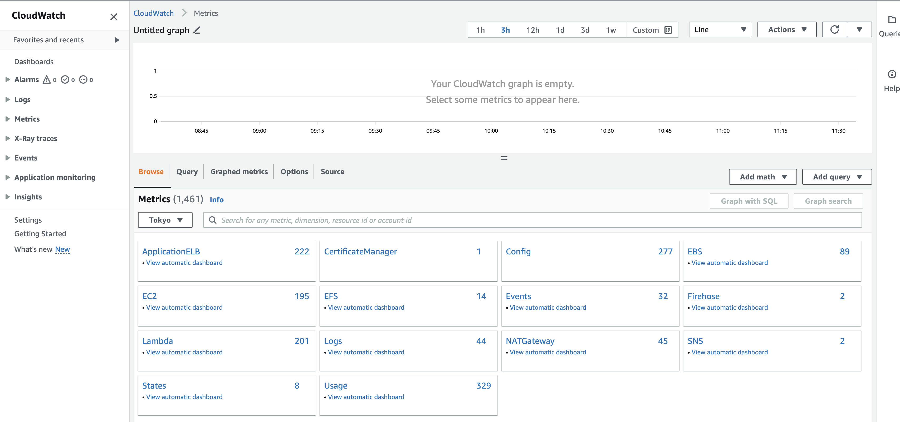
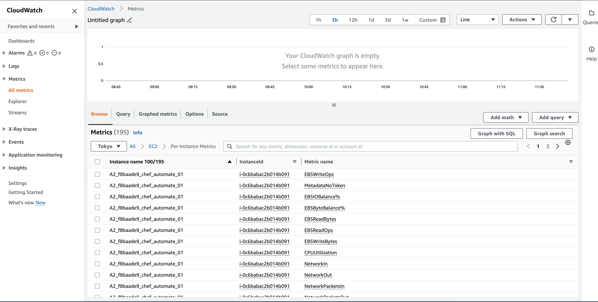
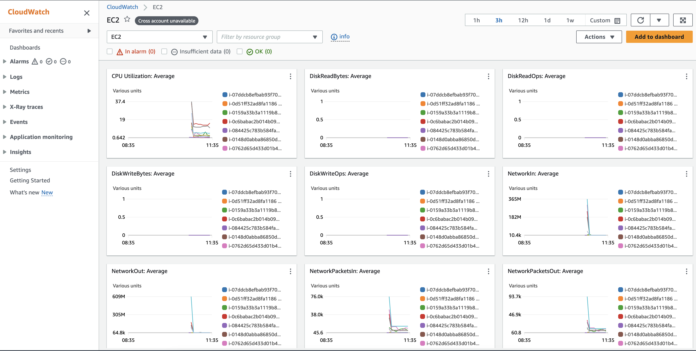

# AutomateHA cluster configuration and Monitoring rules setup with AWS CloudWatch Metrics Monitor

## Description

As an Automate HA user, It is needed to have monitoring rules set for the available metrics on the AWS Cloudwatch console which can be used for tracking and getting notified for Automate HA infrastructure-related health.

Automate HA customer who has chosen the AWS deployment mechanism can opt for this option for metrics and monitoring as part of AWS CloudWatch usage.

### AWS CloudWatch metrics monitor to be set up for

1. Automate and chef server application-level services

1. Managed OpenSearch and Managed Postgres metrics

1. Bastion node

1. System and Disk level usage and performances level metrics

### AWS CloudWatch Monitoring

1. Amazon CloudWatch monitors your Amazon Web Services (AWS) resources and the applications you run on AWS in real-time. You can use CloudWatch to collect and track metrics, which are variables you can measure for your resources and applications.

1. The CloudWatch home page automatically displays metrics about every AWS service you use. You can additionally create custom dashboards to display metrics about your custom applications and display custom collections of metrics that you choose.

1. With AWS there are already existing default monitoring metrics available and guided steps to reach out is defined here [Basic monitoring and detailed monitoring Amazon CloudWatch](https://docs.aws.amazon.com/AmazonCloudWatch/latest/monitoring/cloudwatch-metrics-basic-detailed.html). CloudWatch provides two categories of monitoring: *basic monitoring and detailed monitoring.*

1. Basic monitoring is default active feature for the Amazon EC2 instances for AutomateHA Cluster to publishing a default set of metrics to CloudWatch with no charge to customers.
1. Detailed monitoring provides more frequent metrics, published at one-minute intervals, instead of the five-minute intervals used in Amazon EC2 basic monitoring, you must choose to activate it.  [Enable or turn off detailed monitoring for your instances](https://docs.aws.amazon.com/AWSEC2/latest/UserGuide/using-cloudwatch-new.html)

### CloudWatch Metrics Monitoring

Note: We are using basic monitoring Amazon CloudWatch which provide adequate amount of metrics for AutomateHA cluster monitoring. But depending on needs one can explore for more real-time detailed monitoring feature of Amazon CloudWatch.

1. Login to Amazon CloudWatch Console.

1. Navigate to Metrics section from left side menu.

    

1. Open the required metrics you want to see, for example *EC2* metrics. And select the metric stream.

    

    * You can choose for *automatic pre build cloudwatch dashboard* for particular metrics also.

        

1. Select or filter the AutomateHA cluster instance or metrics want to check.

   

We can further add many more filters and queries to gain the visualization or metrics as per business needs - [Use Amazon CloudWatch metrics](https://docs.aws.amazon.com/AmazonCloudWatch/latest/monitoring/working_with_metrics.html)

### AutomateHA cluster Metrics monitoring setup

Use metrics explorer to monitor AutomateHA cluster resources by their tags and properties. Metrics explorer is a tag-based tool that enables you to filter, aggregate, and visualize your metrics by tags and resource properties, to enhance observability for your services.

1. Open the CloudWatch console.

1. In the navigation pane, choose Explorer.

1. Do one of the following:

   * To use a template, select it in the box that currently shows Empty Explorer.

        Depending on the template, the explorer might immediately display graphs of metrics. If it doesn't, choose one or more tags or properties in the From box and then data should appear. If it doesn't, use the options at the top of the page to display a longer time range in the graphs.

   * To create a custom visualization, under Metrics, choose a single metric or all the available metrics from a service.

        After you choose a metric, you can optionally repeat this step to add more metrics.

    

1. Choose the respective metrics as business needs. For example see below screenshot where

   

1. To add this visualization as a widget to a CloudWatch dashboard, choose **Add to dashboard**.

Refer [here](https://docs.aws.amazon.com/AmazonCloudWatch/latest/monitoring/CloudWatch-Metrics-Explorer.html) for more detailed configuration.

## Monitoring rules for Automate HA

Based on the above-mentioned steps to create a metrics monitor for the Amazon CloudWatch, we can set up monitoring rules for Automate HA based on the metrics which are getting received at Amazon CloudWatch.

1. Here is the list of monitoring rules and logical conditions and details to be referenced for monitor creation: [Monitoring rule list](./Monitoring_rule_list.md)
1. Refer to [Logs and metrics supported by Amazon CloudWatch Application Insights](https://docs.aws.amazon.com/AmazonCloudWatch/latest/monitoring/appinsights-logs-and-metrics.html) for list of metrics can be configured.

To set the monitoring rules we use Amazon SNS allows applications to send time-critical messages to multiple subscribers through a "push" mechanism against the AMS Managed Monitoring System or MMS, Amazon SNS (SNS) topic that the alarms are published to; in this case, MMS and your SQS queues. You can use CloudWatch to create custom metrics and, through an SNS topic, have AMS alarm you appropriately. Refer [Setting up Amazon SNS notifications](https://docs.aws.amazon.com/AmazonCloudWatch/latest/monitoring/US_SetupSNS.html).

1. **Detection Method:** As per the above options select a detection method.

1. **Metrics check:** Select the metrics on which we want to set the monitor as part of the rule definition.

1. **Monitor scope:** Select the environment, and necessary tags as part of the rule definition.

1. **Aggregate by and Graph option** Add the arithmetic logic on the duration on which this check should verify for the threshold.

In nutshell below parameters are required to monitor the AutomateHA cluster.

1. **Service:** for which service monitors exist, like Postgres, OpenSearch, Application services, etc.

1. **Alert Name:** Name of the alert to be shown.

1. **Check  rules:** Metrics to be used and rule added for threshold.

1. **Severity:** Priority of the issue depending on which appropriate alert action and type will be chosen.

1. **Evaluation duration:** Duration on which it will be evaluated.

1. **Alert type:** Slack, Email, Outlook, Pager duty to be selected.

### Steps to configure Amazon CloudWatch Alarm using Amazon SNS

1. Open the CloudWatch console.

1. In the navigation pane, choose Alarms, All alarms.

1. Choose Create alarm.

1. Choose Select Metric.

   

1. Do one of the following:

   * Choose the service namespace that contains the metric that you want. Continue choosing options as they appear to narrow the choices. When a list of metrics appears, select the check box next to the metric that you want.

   * In the search box, enter the name of a metric, account ID, account label, dimension, or resource ID. Then, choose one of the results and continue until a list of metrics appears. Select the check box next to the metric that you want. And Choose **Select metric**.

    

1. Specify metrics conditions:

   * For Whenever metric is, specify whether the metric must be greater than, less than, or equal to the threshold. Under that, **specify the threshold value**.

   

1. Configure Action:

   * Under Notification, select an SNS topic to notify when the alarm triggered.

   * Select the appropriate auto action like To have the alarm perform Auto Scaling, EC2, or Systems Manager actions, choose the appropriate button and choose the alarm state and action to perform.

   

1. Enter a name and description for the alarm. And choose **Next**.

   

1. Under **Preview and create**, confirm that the information and conditions are what you want, then choose **Create alarm**.

Refer [here](https://docs.aws.amazon.com/AmazonCloudWatch/latest/monitoring/AlarmThatSendsEmail.html) for more detailed view for Amazon CloudWatch Alarm.

You can also add alarms to a dashboard. For more information, see [Add or remove an alarm widget from a CloudWatch dashboard](https://docs.aws.amazon.com/AmazonCloudWatch/latest/monitoring/add_remove_alarm_dashboard.html).

**Refer to other alert monitoring rules configuration and integration from the links mentioned below:**

* For [Slack](AWS_CloudWatch_Slack_Integration.md)

* For [PagerDuty](/cloud-watch/AWS_CloudWatch_PagerDuty_Integration_Alerting.md)

* For [AutomateHA Cluster Logging](/cloud-watch/AWS_CloudWatch_Logging_Configration.md)
