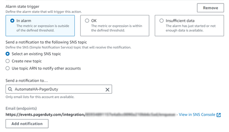
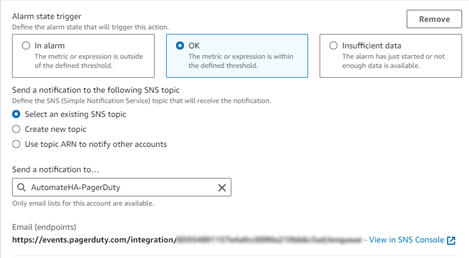

# CloudWatch integration with PagerDuty
### PagerDuty configuration:
1-	Navigate to Services – Service Directory and click **New Service**.

2-	Provide a **Name** and optional **Description** for the Service.

3-	Click **Next**.

4-	Assign an existing or create a new **Escalation Policy**.

5-	Click **Next**.

6-	Make any changes required for **Reduce Noise** settings.

7-	Click **Next**.

8-	Search for **AWS CloudWatch** under **Integrations**.

9-	Check the box for AWS CloudWatch and click **Create Service**.

10-	The Service will be displayed once created.  Copy the *Integration URL** which will be used later in the AWS SNS configuration.

### AWS configuration:
1.	In the Services search bar, search and select **Simple Notification Service (SNS)**. On the SNS dashboard, select Topics and click **Create Topic**. This will be used to route alerts to PagerDuty regarding the Chef Automate HA CloudWatch metrics.

2.	Select **Standard** as the SNS type.

3.	Enter a Topic name (you may want to name your topic after your PagerDuty service's name) and Display name, then click **Create topic**.

4.	Select **Subscriptions** in the left-hand menu and click **Create Subscription**.

5.	Make sure **HTTPS** is the selected Protocol. Paste your **Integration URL** from the PagerDuty Service created earlier into the **Endpoint** field, ensure that the Enable raw message delivery checkbox is unchecked and click **Create Subscription**.

6.	Make sure the Subscription ID is not Pending Confirmation. Refresh to ensure the Subscription ID displays **Confirmed**.

7.	Navigate to Services and search for **CloudWatch**. Navigate to **All Alarms**.

8.	Select any of the Automate HA alarms already created and select Actions – **Edit**. 

9.	Confirm the configured Conditions are correct and click **Next**.

10.	For **Alarm state trigger**, select **In alarm**.

11.	Under **Notification**, chose **Select an existing SNS topic**.

12.	In the Send a notification to dropdown, select the PagerDuty SNS topic created earlier.

13.	Select **Add Notification**.

14.	In the new notification, select **OK** under **Alarm state trigger**.

15.	Under **Notification**, chose **Select an existing SNS topic**.

16.	In the Send a notification to dropdown, select the PagerDuty SNS topic created earlier.

17.	Click **Next** and then **Update alarm**.

18.	The integration of Amazon CloudWatch with PagerDuty is complete. Now when your alarm threshold is met, an incident will be triggered within PagerDuty.

19.	Once that alarm is back in an OK state, the incident will automatically resolve within PagerDuty.

