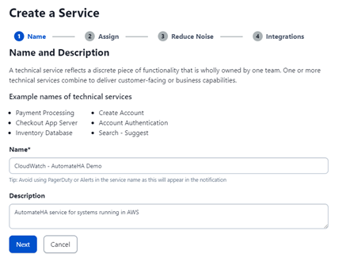
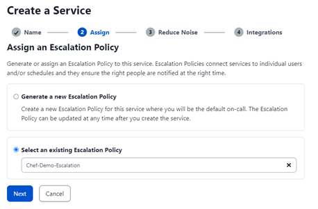
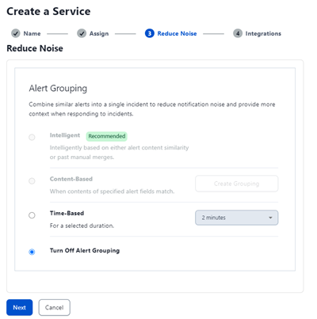
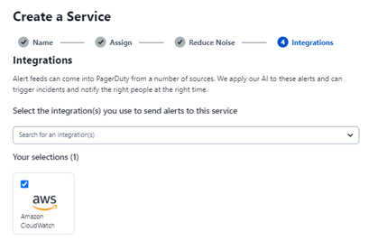
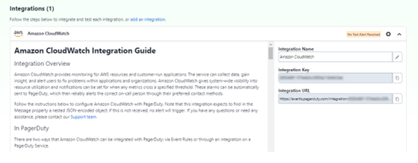
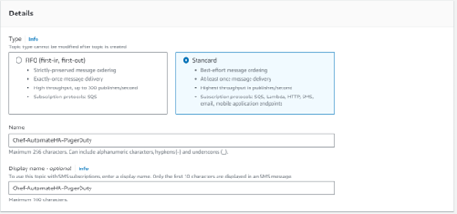
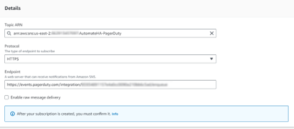
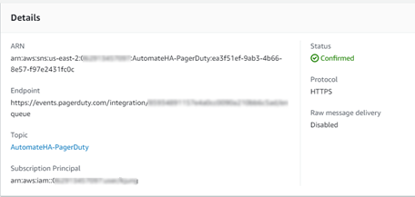
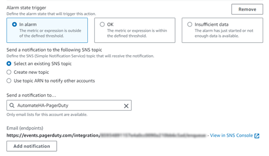
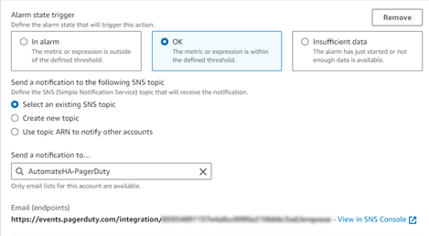

# CloudWatch integration with PagerDuty

This whitepaper will leverage the PagerDuty integration with AWS to set up the connection with CloudWatch alarms. The configuration will start with creating an AWS SNS Topic for the CloudWatch Alarms.  The AWS SNS Topic can send CloudWatch alarms directly to PagerDuty via HTTPS.

## PagerDuty Configuration

1. Navigate to Services – Service Directory and select **New Service**.

1. Provide a **Name** and optional **Description** for the Service.

    

1. Select **Next**.

1. Assign an existing or create a new **Escalation Policy**.

    

1. Select **Next**.

1. Make any changes required for **Reduce Noise** settings.

    

1. Select **Next**.

1. Search for **AWS CloudWatch** under **Integrations**.

    

1. Check the box for AWS CloudWatch and select **Create Service**.

1. The Service will be displayed once created.  Copy the *Integration URL**, which will be used later in the AWS SNS configuration.

    

## AWS Configuration

1. In the Services search bar, search and select **Simple Notification Service (SNS)**. On the SNS dashboard, select Topics and select **Create Topic**. This will route alerts to PagerDuty regarding the Chef Automate HA CloudWatch metrics.

1. Select **Standard** as the SNS type.

1. Enter a topic name (you may want to name your topic after your PagerDuty service's name) and display name, then select **Create topic**.

    

1. Select **Subscriptions** in the left-hand menu and select **Create Subscription**.

1. Make sure **HTTPS** is the selected Protocol. Paste your **Integration URL** from the PagerDuty Service created earlier into the **Endpoint** field, ensure the Enable raw message delivery checkbox is unchecked, and select **Create Subscription**.

    

1. Make sure the Subscription ID is not Pending Confirmation. Refresh to ensure the Subscription ID displays **Confirmed**.

    

1. Navigate to Services and search for **CloudWatch**. Navigate to **All Alarms**.

1. Select any Automate HA alarms already created and select Actions – **Edit**.

1. Confirm the configured Conditions are correct and select **Next**.

1. For the **Alarm state trigger**, select **In alarm**.

1. Under **Notification**, choose **Select an existing SNS topic**.

1. select the PagerDuty SNS topic created earlier in the Send a notification dropdown.

    

1. Select **Add Notification**.

1. In the new notification, select **OK** under the **Alarm state trigger**.

1. Under **Notification**, choose **Select an existing SNS topic**.

1. Select the PagerDuty SNS topic created earlier in the Send a notification dropdown.

    

1. Select **Next** and then **Update alarm**.

1. The integration of Amazon CloudWatch with PagerDuty is complete. When your alarm threshold is met, an incident will be triggered within PagerDuty.

1. Once that alarm is back in OK, the incident will automatically resolve within PagerDuty.
