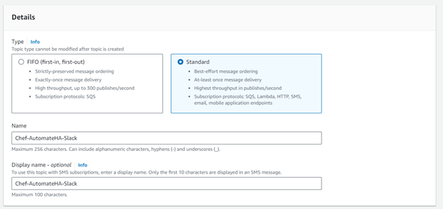
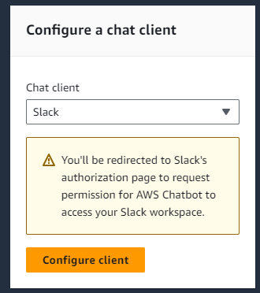
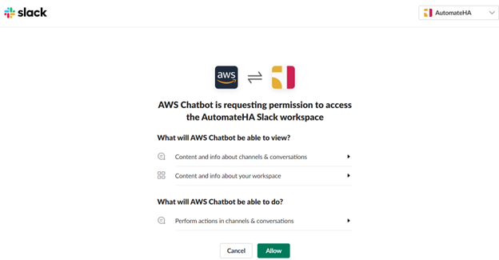
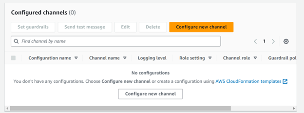
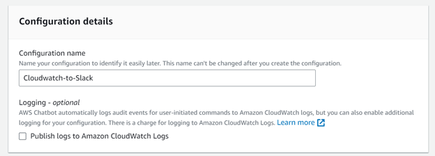
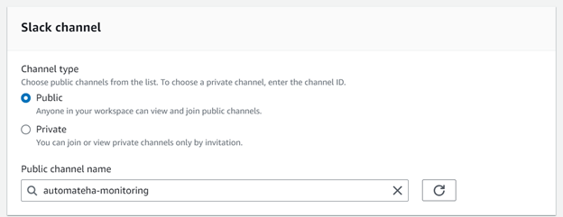
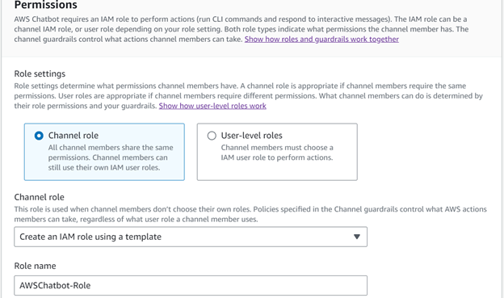
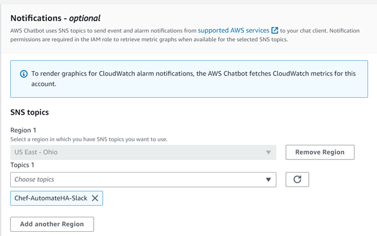
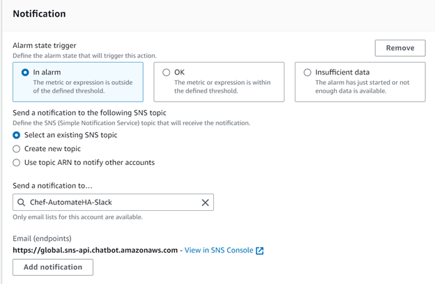
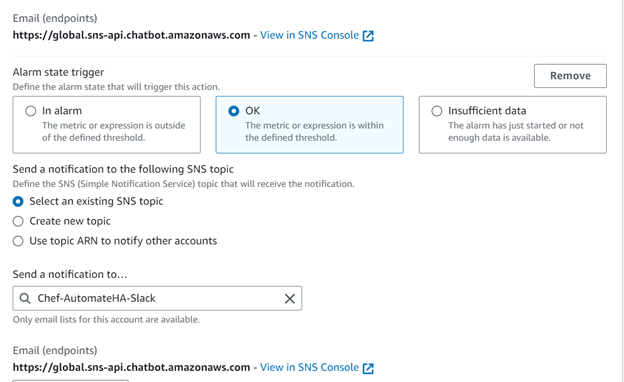

# CloudWatch integration with Slack

There are several different approaches on sending CloudWatch Alarms to Slack. As an example, the use of Lambda Funcations could be leveraged to make the connection between AWS and Slack. This whitepaper will leverage AWS ChatBot to establish integration between AWS CloudWatch and Slack. The configuration will start with creating an AWS SNS Topic for the CloudWatch Alarms.  Once complete the AWS Chatbot will be created which will send messages received in the SNS Topic to the chosen Slack Channel.

### AWS SNS configuration:
1.	In the Services search bar, search and select **Simple Notification Service (SNS)**. On the SNS dashboard, select **Topics** and click **Create Topic**. This will be used to route alerts to AWS Chatbot regarding the Chef Automate HA CloudWatch metrics.

2.	Select **Standard** as the **SNS type**.

3.	Enter a Topic name (you may want to name your topic after your PagerDuty service's name) and Display name, then click **Create topic**.

### AWS Chatbot configuration:

1.	Navigate to Services and search of **Chatbot**.

2.	In the Configure a chat client select **Slack** and click **Configure Client**.

3.	You will be redirected to Slack.  

4.	If not already authenticated to Slack, sign in.

5.	Select the Slack Workspace you would like to send alerts to in the top right corner.

6.	Click Allow and you will be redirected back to AWS Chatbot configuration.

7.	Click Configure new channel.

8.	Provide a Configuration name.

9.	Select the Slack Channel to send alerts to.

10.	Under permissions, provide a **Role name** and keep the defaults for Policy 

11.	Under Notifications – optional, select the region for the SNS Topic created earlier and select the SNS Topic.

12.	Click **Configure**.

*** AWS CloudWatch configuration:

1.	Navigate to Services and search for **CloudWatch**. Navigate to **All Alarms**.

2.	Select any of the Automate HA alarms already created and select Actions – **Edit**. 

3.	Confirm the configured Conditions are correct and click **Next**.

4.	For Alarm state trigger, select **In alarm**.

5.	Under Notification, chose Select an existing SNS topic.

6.	In the Send a notification to dropdown, select the SNS topic created earlier.

7.	Select **Add Notification**.
**
8.	In the new notification, select **OK** under **Alarm state trigger**.

9.	Under Notification, chose **Select an existing SNS topic**.

10.	In the Send a notification to dropdown, select the PagerDuty SNS topic created earlier.

11.	Click **Next** and then **Update alarm**.

12.	The integration of Amazon CloudWatch with Slack is complete. Now when your alarm threshold is met, an incident will be triggered within the Slack Channel.

13.	Once that alarm is back in an OK state, the incident will automatically resolve.
