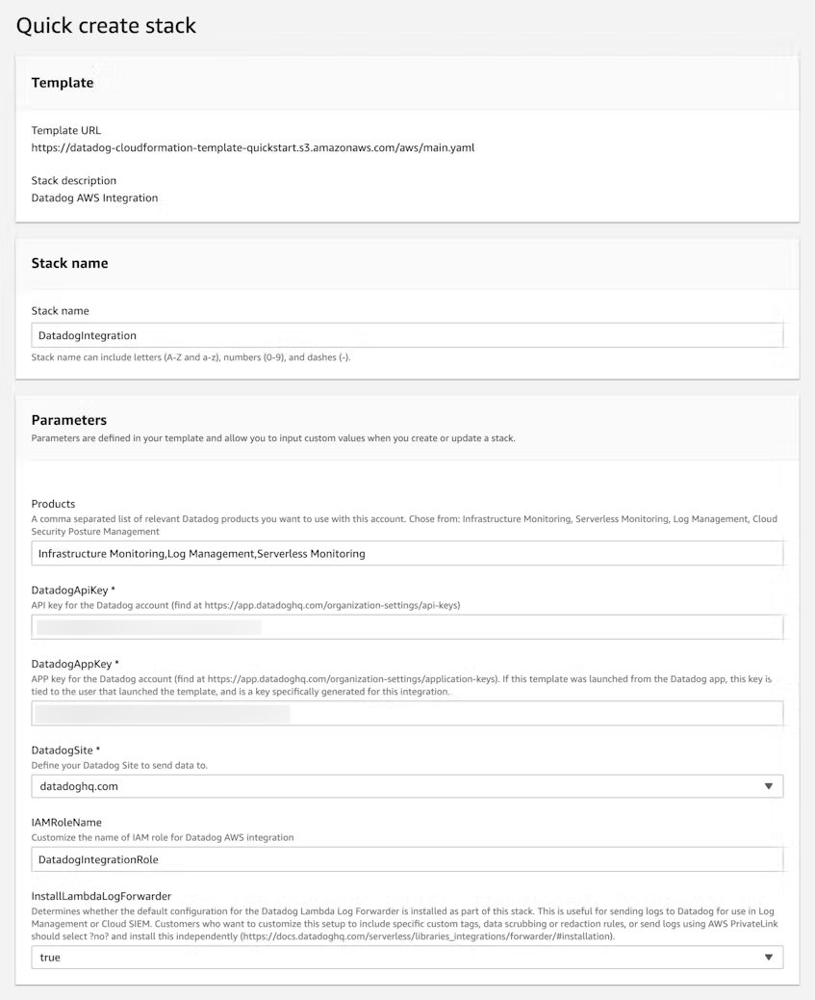

# DataDog AWS Integration

## Overview

As an Automate HA customer, need to integrate Data dog with AWS in order to receive metrics from the AWS services. In the case of Automate HA deployment with managed services and AWS S3 being used for backup, these services need to be integrated with Data Dog in order to ensure monitoring and alerting for them.

Connect to Amazon Web Services (AWS) to:

* See automatic AWS status updates in your Events Explorer

* Get CloudWatch metrics for EC2 hosts without installing the Agent

* Tag your EC2 hosts with EC2-specific information

* See EC2 scheduled maintenance events in your stream

* Collect CloudWatch metrics and events from many other AWS products

* See CloudWatch alarms in your Events Explorer

**Note:** Datadog’s Amazon Web Services integration collects logs, events, and all metrics from CloudWatch for over 90 AWS services.

## Setup Methods

* **CloudFormation (Best for quickly getting started):** To set up the AWS integration with CloudFormation, see [the AWS getting started guide](https://docs.datadoghq.com/getting_started/integrations/aws/)

* **Terraform:** To set up the AWS integration with Terraform, see the [AWS integration with Terraform.](https://docs.datadoghq.com/integrations/guide/aws-terraform-setup/)

* **Role Delegation:** To set up the AWS integration manually with role delegation. [see the manual setup guide.](https://docs.datadoghq.com/integrations/guide/aws-manual-setup/?tab=roledelegation)

## Setup

1. Go to the AWS integration configuration page in Datadog and click Add AWS Account.

    

1. Configure the integration’s settings under the Automatically using CloudFormation option.

    

   * Select the AWS regions to integrate with.

   * Add your Datadog API key.

1. Click *Launch CloudFormation Template*. This opens the AWS Console and loads the CloudFormation stack. All the parameters are filled in based on your selections in the prior Datadog form, so you do not need to edit those unless desired.

    

     The *DatadogAppKey* parameter enables the CloudFormation stack to make API calls to Datadog to add and edit the Datadog configuration for this AWS account. The key is automatically generated and tied to your Datadog account. 

    

1. Check the required boxes from AWS and click *Create stack*. This launches the creation process for the Datadog stack along with three nested stacks. This could take several minutes. Ensure that the stack is successfully created before proceeding.

1. After the stack is created, go back to the AWS integration tile in Datadog and click *Ready!*

1. Select the AWS account and select the relevant AWS resources whose metrics we want at data dog

    

1. Wait up to 10 minutes for data to start being collected, and then view the out-of-the-box AWS overview dashboard to see metrics sent by your AWS services and infrastructure:

    
    

## Tags

The following some tags are collected with the AWS integration. Note: Some tags only display on specific metrics.

| INTEGRATION | DATADOG TAG KEYS |
| :--- | :-- |
|All|region|
EBS |	volumeid, volume-name, volume-type
EC2 |	autoscaling_group, availability-zone, image, instance-id, instance-type, kernel, name, security_group_name
ElastiCache |	cachenodeid, cache_node_type, cacheclusterid, cluster_name, engine, engine_version, preferred_availability-zone, replication_group
ELB |	availability-zone, hostname, loadbalancername, name, targetgroup
ES |	dedicated_master_enabled, ebs_enabled, elasticsearch_version, instance_type, zone_awareness_enabled
Health |	event_category, status, service
RDS |	auto_minor_version_upgrade, dbinstanceclass, dbclusteridentifier, dbinstanceidentifier, dbname, engine, engineversion, hostname, name, publicly_accessible, secondary_availability-zone
Route 53 |	healthcheckid
S3 |	bucketname, filterid, storagetyp
VPC |	nategatewayid, vpnid, tunnelipaddress
