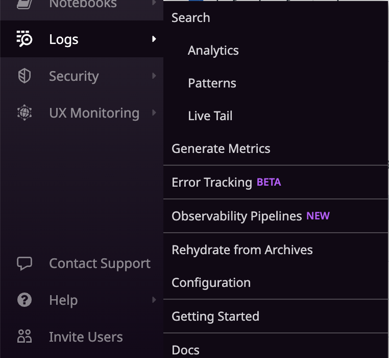
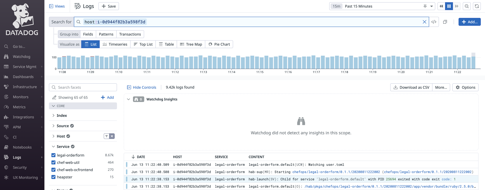
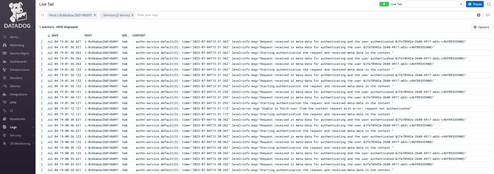
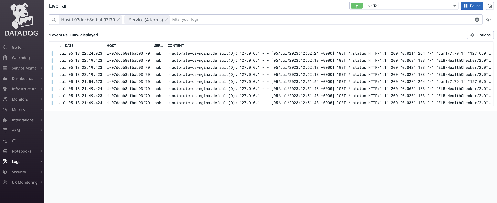

# DataDog centralized logs management

## Prerequisites

+ Follow this [documentation](data-dog/DataDog-Installation_and_Configration.md) to download, install and configure the Datadog agent on the Automate HA infrastructure nodes.
+ Ensure that the agent is running successfully on all the nodes.

## Log management Configuration

In case we want to send the logs as well to the data dog of all instances, this configuration needs to be added to ensure all logs are getting sent to the data dog server.

* Type of configuration required for Automate HA setup, in order to ensure that all the components of Automate HA are sending the relevant logs metrics to data dog

| Config file (Final DD agent location) | Details   |
| :--- | :-- |
|/etc/datadog-agent/conf.d/journald.d/conf.yaml|**Journalctl logs** In case we want to send the logs as well to data dog, this cionfiguration needs to be added to esnure all journal ctl logs are getting sent to data dog. Reference location for actual values:  [journald.yaml](YML_Files/journald.yaml)|
|/etc/datadog-agent/conf.d/journald.d/syslog.yaml|**System logs** Enable this config for system level logs. Reference location for actual values: [syslog.yaml](YML_Files/syslog.yaml)|
|/etc/datadog-agent/conf.d/systemd.d/conf.yaml|**Systemd logs** Enable this config for systemd logs. Reference location for actual values: [systemd.yaml](YML_Files/systemd.yaml)|

+ Once the above configuration is added, restart the data dog agent by running below commands on all the nodes:
  `sudo service datadog-agent restart`

## Verify Logs on Datadog Console

To check this log:

1. Log-in to your Datadog console
1. Click on "Logs" menu.
1. Select the appropriate use case or "Search" for all logs, from the sub-menu.

   

1. Filter the logs with your instance tags or hostname, etc.

See the below screenshot for the reference:

    

## Custom Centralized Logging with DataDog

To have custom centralized logging with DataDog; we need to add the particular service at the [Journald.yaml](YML_Files/journald.yaml) and only that particular service log will come.

For example: To get logs for chef automate service -  "authn-service" include the same unit at /etc/datadog-agent/conf.d/journald.d/conf.yaml file, same like below:

    - type: journald
        path: /run/log/journal
        log_processing_rules:
        - type: include_at_match
          name: include_authnservice
          ## Regexp can be anything
          pattern: .*authn-service.*

Another example: To get logs for chef server service -  "automate-cs-nginx" include the same unit at /etc/datadog-agent/conf.d/journald.d/conf.yaml file, same like below:

    - type: journald
        path: /run/log/journal
        log_processing_rules:
        - type: include_at_match
          name: include_automate-cs-nginx
          ## Regexp can be anything
          pattern: .*automate-cs-nginx.*

 You can include multiple service patterns in above yaml file. 
