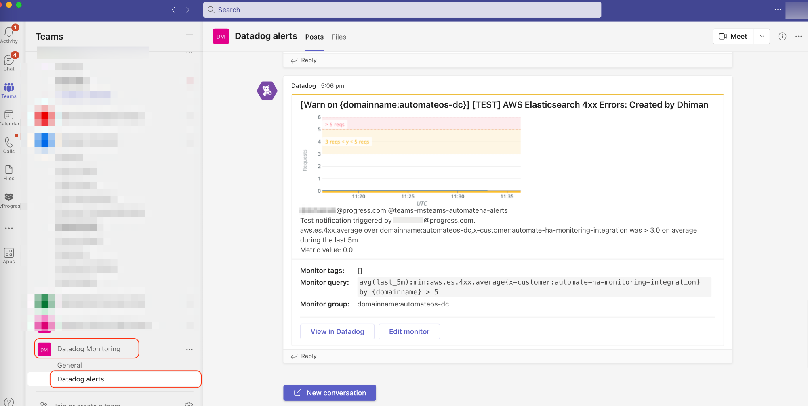

# Datadog Integration with Microsoft Teams for Notification and Alerts

Webhooks are a great way to integrate MS Teams with external apps, Datadog in our case. It is an HTTP POST request that is sent to a callback URL to provide messages and notifications; thereby allowing connetions to Web Services to MS Teams. With this, you can:

* Respond to messages when @mentioned (outgoing webhooks)
* Send proactive messages to configured channels in MS teams (incoming webhooks and connectors)

Here, we are going to concentrate on **incoming webhooks and connectors**

You can forward all the notifications and alerts for Chef Automate in Datadog to Microsoft Teams

## Step1: Configure your MS Teams Connectors

* Login to MS Teams
* Click on Teams --> Select the Team --> Add channel. Here we named the channel "Datadog alerts"

* Create connector

**Note:** In newer version of Microsoft Teams, the option of connectors menu is moved to below location. Kindly follow the same if you have similar version of Microsoft Teams:

    - Go to "manage channel" > Find "Connectors" option.
    - Click on "Edit" button from Connector section.
See below screenshot for reference.

* Search for Datadog, click add and then click Configure

* Configure the webhook URL here; it's a self explanatory step, once done, click on save. You will need this URL later to integrate in the Datadog application.

## Step2: Setting up Datadog account in Microsoft Teams

* On Microsoft Teams, click on **Apps** in the vertical toolbar

* Search for "Datadog"

* Click **Add** to install the Datadog App

* Now go to your Datadog application, navigate to [Microsoft Teams Title](https://app.datadoghq.com/account/settings?_gl=1*2j0s4k*_gcl_au*MjYxMTI0MTE2LjE2ODYyMDIwNDQ.*_ga*MjEyMDkyMzE0Mi4xNjg2MjAyMDQ0*_ga_KN80RDFSQK*MTY4Njk0NDc1MS4xMi4xLjE2ODY5NDQ3NzguMzMuMC4w*_fplc*RVglMkIxRzJRUmRCWjB2em8lMkZ0Z0Q1U05FN1l0UVNHUDYwU2tsQ3VIeTVFZ2Naa1kzY3lhYnBhSWU5bzNPYWREWWlWS245VlJqdndKN1ZNZlR5bk1rRERhbExMMzByNCUyRlMlMkY2a0dJdHAyNWxrQnYwNHZHa1U2VkhnSUJrWjNpdkElM0QlM0Q.#integrations/microsoft-teams)

Or, in the Datadog app, from the left hand bar, click on Integrations --> Integrations; search for Microsoft Teams, install and then click on configure.

* Click on **Add Account** which will redirect you to Microsoft Authentication, follow the prompts and click **Ok**

**Note:** It usually takes a few hours for MS teams to build the MS teams groups within Datadog for setting up notifications

## Step3: Configure Webhook in Datadog Application

* Login to https://app.datadoghq.com/ with your credentials
* Under the page, click on Integrations --> Integrations

* Search for microsoft teams and the click on Configure

* Add MS teams channel with the webhook url

**Note:** We will need this teams channel name which setting up notifications and alerts to be sent to Microsoft Teams webhook in the next step.

## Step4: Setting up Notification Settings for Microsoft Teams

* Login to https://app.datadoghq.com/ with your credentials
* From the left-hand side, click on Service Mgmt --> Incidents --> Settings --> Integrations; make tyhe following changes for Datadog to send notifications to Microsoft Teams

Here, under "Microsoft Teams" section, make the following appends:
* Key in the following information from what you had created in your Microsoft Teams Account:
  * Tenant
  * Team
  * Channel

Once done, click on **Save**

## Step5: Setting up Notifications/Alerts

It is time now to setup monitors for your Automate HA infrastructure that can be sent as notifications/alerts over Teams and Email

You can use the monitoring section to learn how to create new monitors. To setup context for this section, let us take a simple monitor created for notifying 4xx errors on the Opensearch Service

In the Datadog app, go to Monitors --> New Monitor

* Select the detection method (we have selected "Threshold Alert" here)
* Define what metrics you need to monitor
* Define your alert conditions

### Notification Settings

To create notifications/alerts to be sent to the designated Teams webhook (with MS Teams Channel) you created in Step2

In Step2, the webhook was associated to Microsoft Teams Channel **msteams-automateha-alerts**

To set up notifications, you can take a cue from "Use Message Template Variables" as highlighted below.

Once done, you can also test if the notications actually reach their desired targets, by clicking on **Test Notifications**. After confirming that you received the alerts in your teams channel (as shown below), click on **save** to make it perpetual.

## References:

You can use the following official references:

* [Integrate MS Teams in Datadog for Notifications](https://docs.datadoghq.com/integrations/microsoft_teams/#send-monitor-notifications-to-a-microsoft-teams-channel)

* [Configure Monitors in Datadog](https://docs.datadoghq.com/monitors/configuration/?tab=thresholdalert#notify-your-team)

