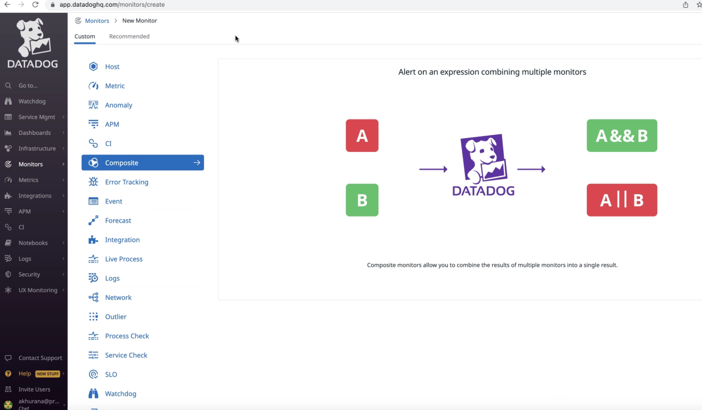
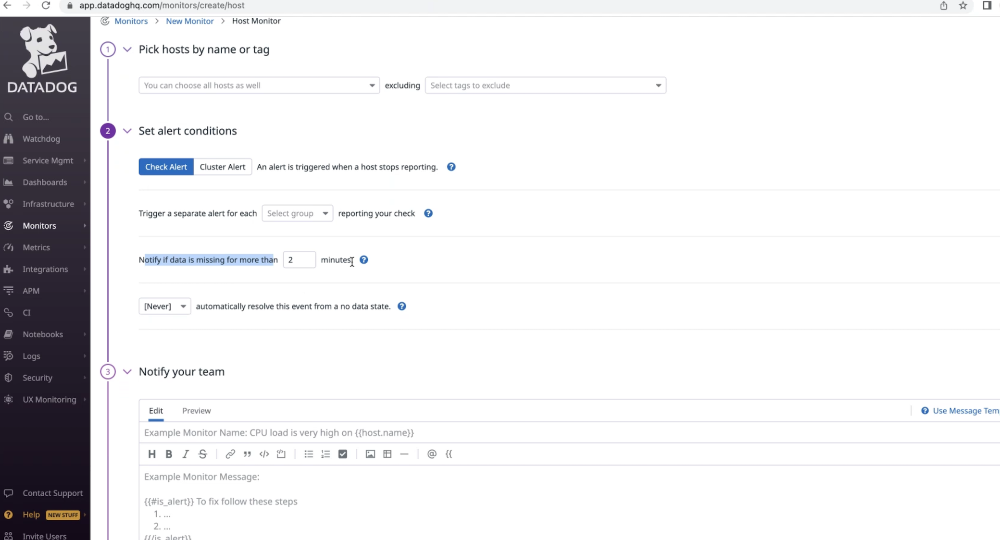
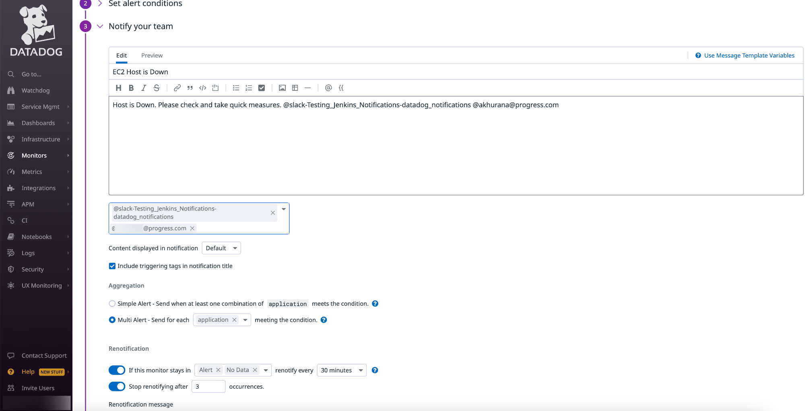

# Monitor configuration and alerting

In the Datadog UI:

 * Got to Monitor -> new monitor and create a Custom monitor

 * There are options to create monitors based on Hosts. process, metrices, etc. For this use case, we are going to create a monitor for Hosts.

    

 * Pick hosts you want to monitor filtering those by tags which need to be added to the hosts at the time of creation.

    

 * Select the option to automatically resolve the alerts after a specified period of time or it needs to be resolved by manual intervention of an user.

 * There is the option to notify the team responsible for the infrastructure monitoring via email or slack or teams or pgerduty. The detailed steps on integrating Datadog with these alerting applications are explianed in dedictaed sections.

 * Datadog provides the flexibility of renotification of the same alert which can be configured to renotify in the alerting app multiple times after a fixed interval of time.

    

 * Different alerts need to be set a priority level depending on the impact they create on the performance or functioning of the applications. Priority for the custom alerts should be set in order to address those accordingly meeting the SLAs.

 * Role based access control needs to be applied to the custom monitors and alerts crtaed which dictates Who can edit/delete my alert and eho will it be notified to.

    