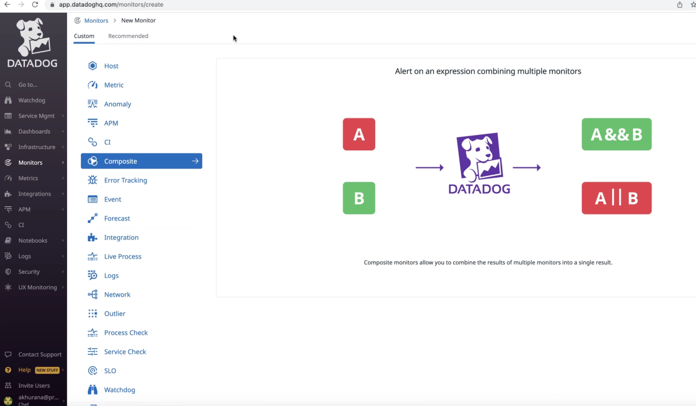
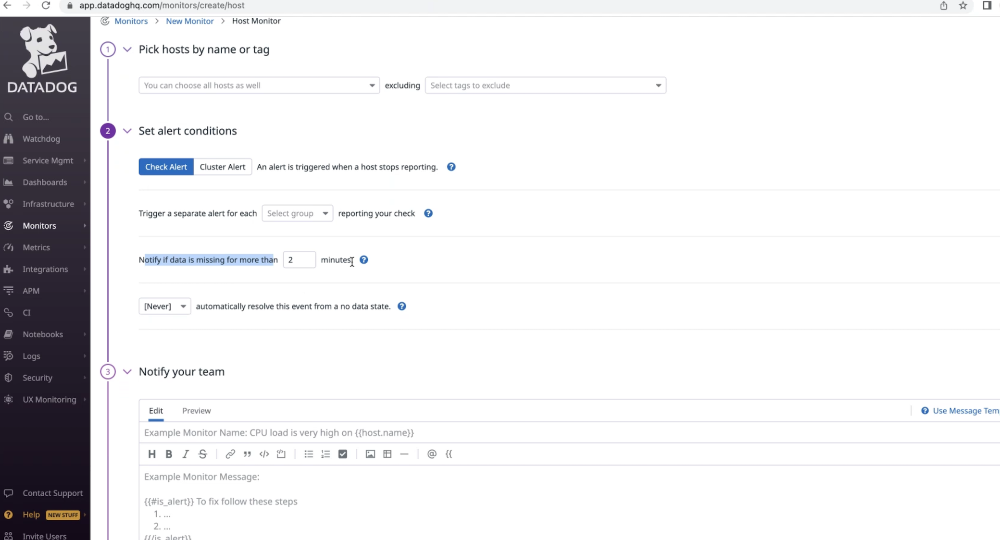
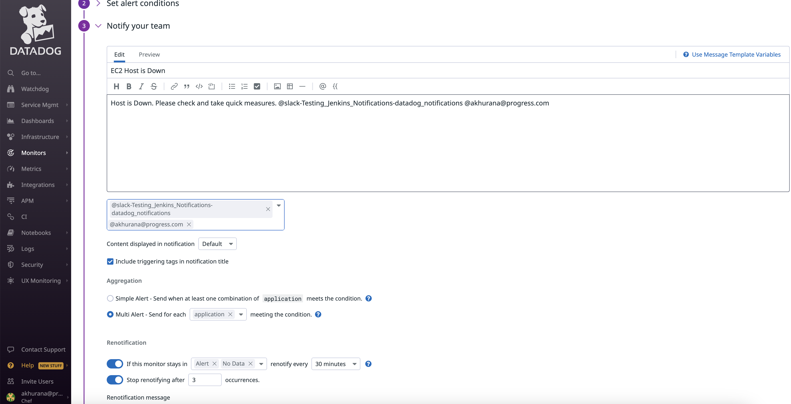
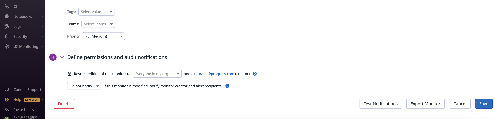

# Monitor configuration and alerting

**Description**

As an Automate HA customer, I need to have monitoring rules set for the available metrics on the data dog console which can be used for tracking and getting notified for Automate HA infrastructure-related health.

A metric monitor provides alerts and notifications if a specific metric is above or below a certain threshold.

**Data Dog Monitors:**
* Monitors are based on metrics collected by the Data Dog agent. Create monitors that warn or alert based on the count of any metrics across hosts or tags.
* Metric monitors are useful for a continuous stream of metrics. Any metric sent to Datadog can be alerted upon if they cross a threshold over a given period of time.
* Here is the list of monitoring rules and logical conditions and details to be referenced for monitor creation: [Monitoring rule list](Monitoring_rule_list.md)

**Prerequisites**

Before getting started, you need a Datadog account linked to a host with the Datadog Agent installed.

**Steps to perfomr at the Datadog UI:**

 * To create a metric monitor in Datadog, use the main navigation: Monitor -> new monitor and create a Custom monitor

 * To define the metric - There are options to create monitors based on Hosts. process, metrices, etc. For this use case, we are going to create a monitor for Hosts.

    

 * Pick hosts you want to monitor filtering those by tags which need to be added to the hosts at the time of creation.

    

 * Set alert conditions - Select the option to automatically resolve the alerts after a specified period of time or it needs to be resolved by manual intervention of an user.

 * Notify your team - There is the option to notify the team responsible for the infrastructure monitoring via email or slack or teams or pgerduty. The detailed steps on integrating Datadog with these alerting applications are explianed in dedictaed sections.

 * Datadog provides the flexibility of renotification of the same alert which can be configured to renotify in the alerting app multiple times after a fixed interval of time.

    

 * Permissions - Different alerts need to be set a priority level depending on the impact they create on the performance or functioning of the applications. Priority for the custom alerts should be set in order to address those accordingly meeting the SLAs.

 * Role based access control needs to be applied to the custom monitors and alerts cretaed which dictates who can edit/delete my alert and eho will it be notified to.

    

 * Click on save button.

You can view Monitored saved at **Manage Monitors" tab and can edit and trigger the same as required.