# PagerDuty Integration and Notification

Connect PagerDuty to Datadog to:

* Notify on-call responders based on alerts triggered from Datadog.

* See incidents and escalations.

* Get daily reminders as to who is on-call.

What you’ll need:

* Admin or Standard role permissions for your Datadog account (unless your organization has created custom role)

* Admin role in PagerDuty Account

## Data Dog and PagerDuty Integration

The connection between Data Dog and PagerDuty must be created first.

1. In Data Dog select the **Integrations** Tab from the left-hand navigation.

1. In the search field, type in **PagerDuty** and select the **Install** button.

      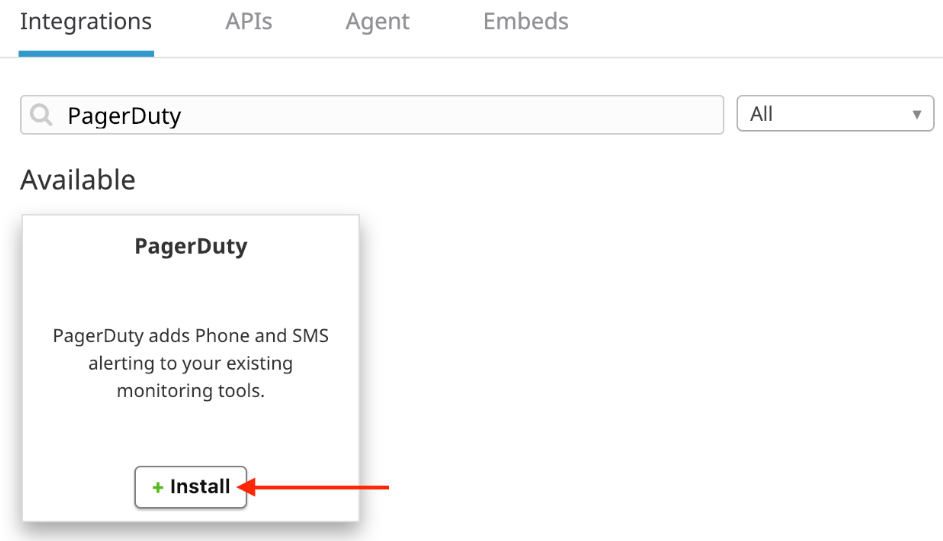

1. Select the **Configuration** tab and then click **Alert with PagerDuty**.

1. On the PagerDuty authorization screen there are two options to integrate with Data Dog.

* Enter your PagerDuty account using the **email address** and **password** and click **Authorize Integration**.

   or

* Use Single Sign On by providing your PagerDuty **Subdomain** and click **Sign In Using Your Identity Provider**.

      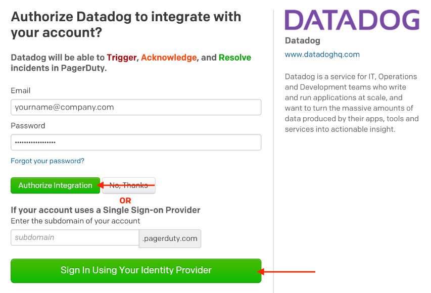

1. Once authenticated, you may choose to integrate with a **PagerDuty Service** or **Global Event Routing**.

1. Select **Finish Integration**

## PagerDuty Configuration

1. Create PagerDuty Team

      * In PagerDuty, navigate to **People** and **Teams**.

      * Select **+ New Team**.

      * Provide a unique **Name** for the Team and optional **Tags**.

      * Select **Save**.

            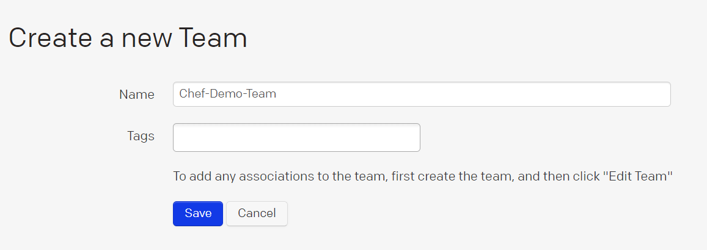

1. Create Escalation Policy

      * In PagerDuty, navigation to **People** and **Escalation Policies**.

      * Click **+ New Escalation Policy**.

      * Provide a unique **Name** for the Escalation Policy and optional **Description**.

      * Select the **Team** that was created in the previous step.

      * Provide optional **Tags**.

      * Enter the required **Users* and/or **Schedules** to be notified.

      * Click **Save**.

            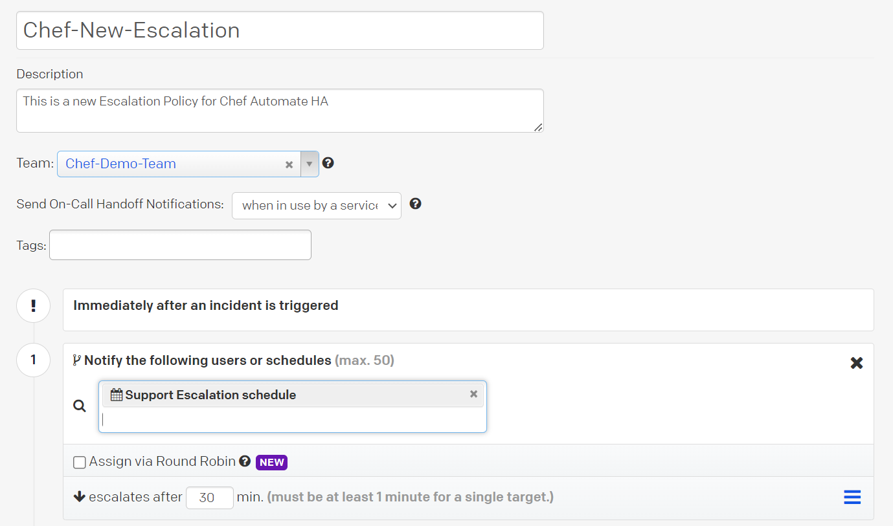

1. Create Service

      * In PagerDuty, navigate to **Services**.

      * Click **+ new Service**

      * Provide a unique **Name** and optional **Description**

      * Click **Next**.

            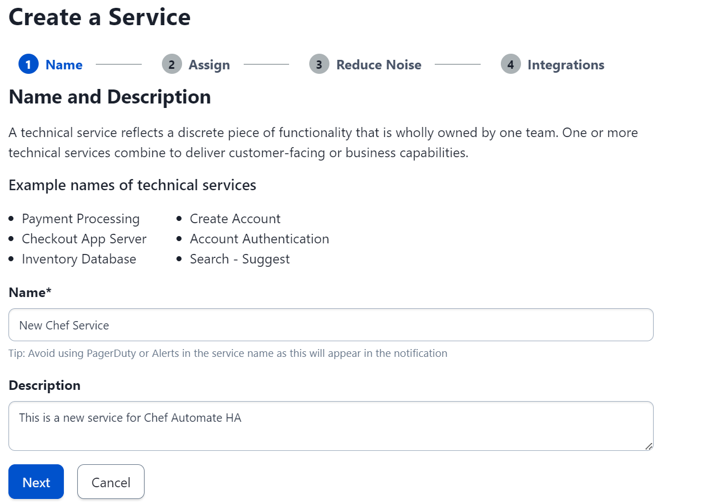

      * Click the **Select an Existing Escalation Policy** and choose the **Escalation Policy** created in the previous step.

      * Click **Next**.

            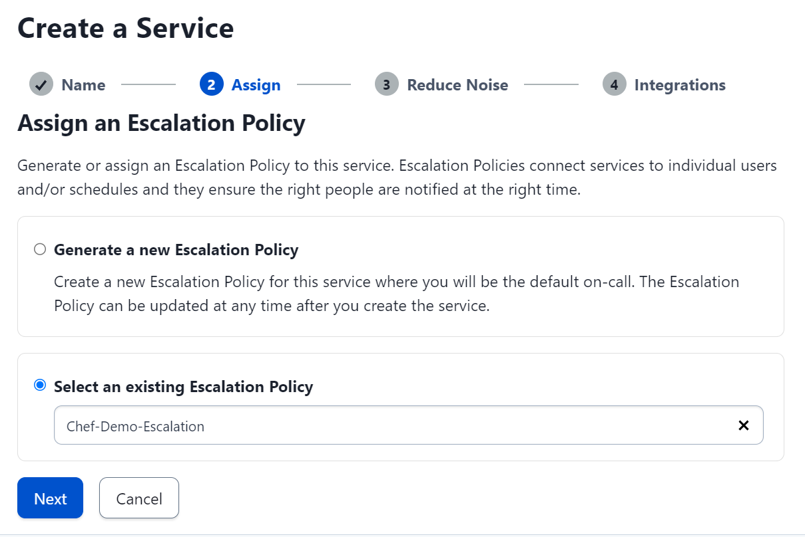

      * Choose the required **Reduce Noise** option

      * Click **Next**.

            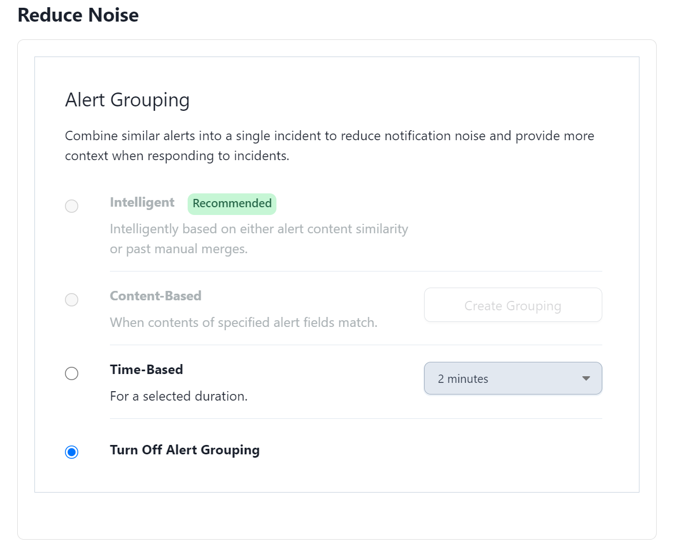

      * Under Integration, select **Data Dog**.

      * Click **Create Service**.

            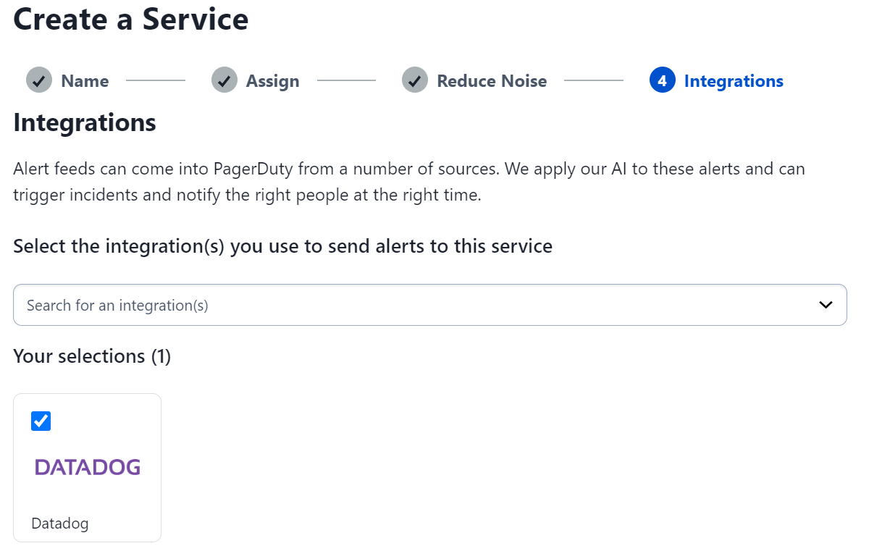

1. The Service will open up in the Integration tab

      * Copy the **Integration Key**.

         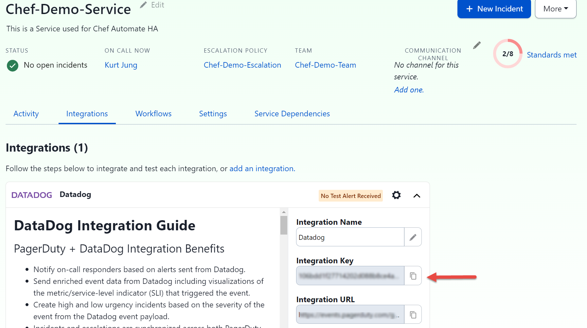

## Data Dog Configuration

1. In Data Dog select the **Integrations** Tab from the left-hand navigation

      * Search for **PagerDuty** in the search field.

      * Click on the **CONFIGURE** button.

            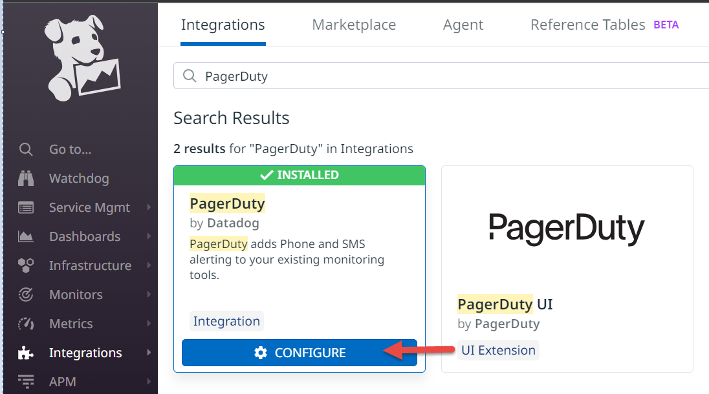

1. Select **Set Up Manually** button.

      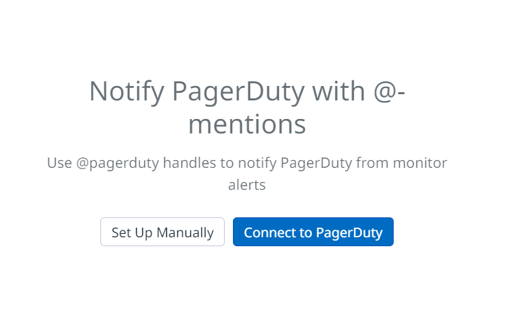

1. Enter the **Service Name** and the copied **Integration Key** obtained in the previous step.

      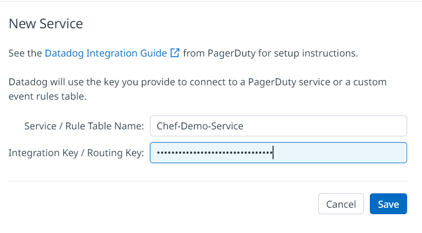

1. Select **Save**.

## Test Integration

1. In Data Dog, navigate to **Monitors**.

1. Create a new or update an existing Monitor

1. In the **Notify your team** section, enter the Service by using the following syntax.

      ```sh
      @pagerduty-< Service Name >

      Example: @pagerduty-Chef-Demo-Service
      ```

      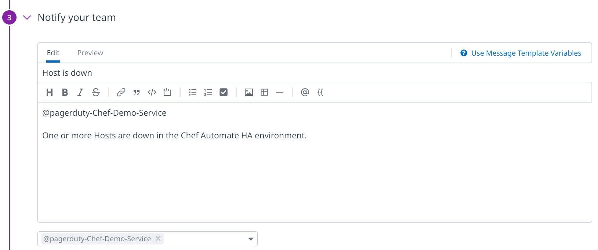

1. Select **Test Notifications**.

1. Select **Run Test**.

      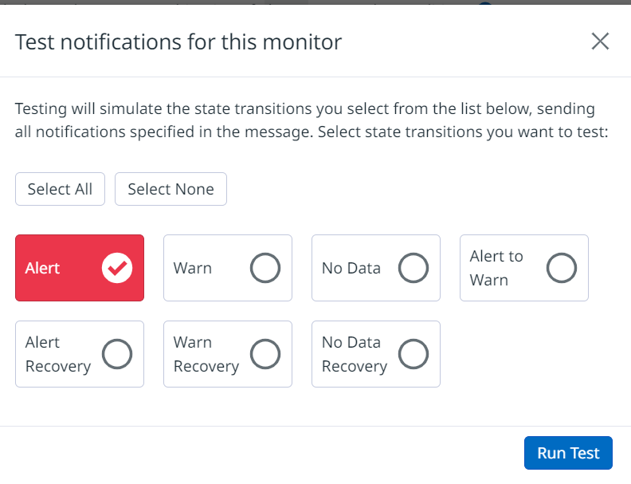

1. The Alert will be sent to address configured in PagerDuty.
