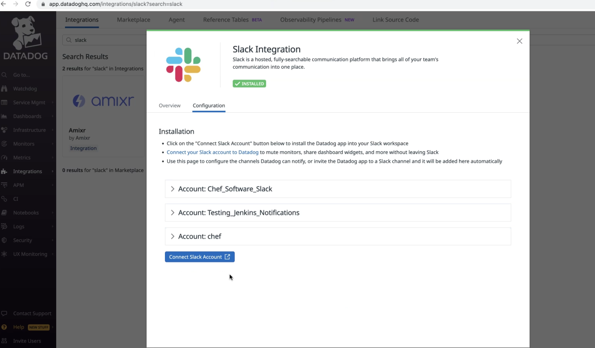
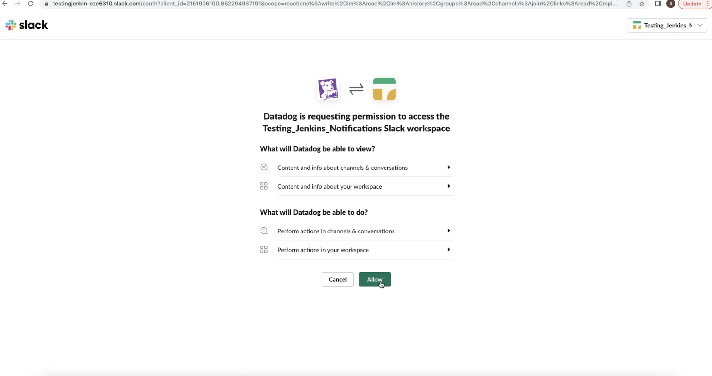
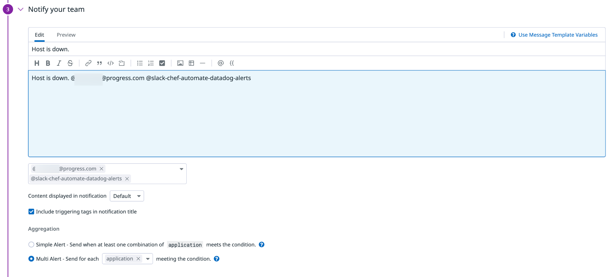

# Slack Integration and Notification

## Description

As an Automate HA customer, I need to integrate Datadog with a Slack tool to ensure I am notified over the set option in case of any higher severity issues.
Connecting Slack to Datadog to help your team collaborate by:

1. Sharing graphs in private or public Slack channels.

1. Receiving alerts and notifications from Datadog within Slack.

1. Muting triggering monitors and declaring incidents from Slack.

## What You Need

Admin or Standard role permissions for your Datadog account (unless your organization has created custom roles)

1. In the Slack App, select your workspace and choose/create the Slack channel for triggering Datadog alerts.

1. In Datadog UI:

    * Navigate to Integration -> select slack.

    * Select **Configure** -> connect Slack account.

        

    * Select your intended workspace from drop-down in the top right corner.

    * Select **Add Channel** -> Type the channel name if it is not showing and then select **Save**.

        

1. In Slack:

    * Under apps -> Datadog > Select **Add this app to a channel**

    * A new message should appear in the channel saying **Datadog was added to this channel**.

1. Test the Integration:

    * In the Datadog app, go to monitor -> edit -> add the name of the slack channel created for notification purposes below the notification message.

        

    * Select **Test Notification** at the bottom of the screen.

    * A sample notification in the channel should confirm the Datadog-slack integration is successful.
