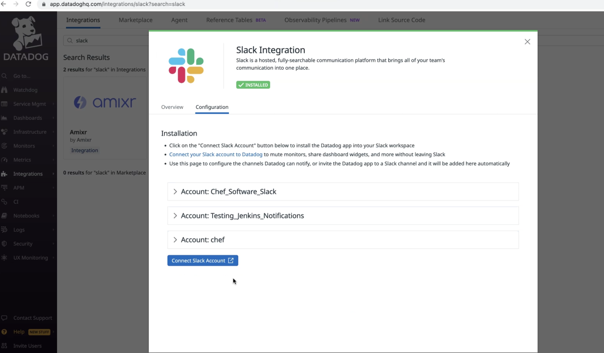
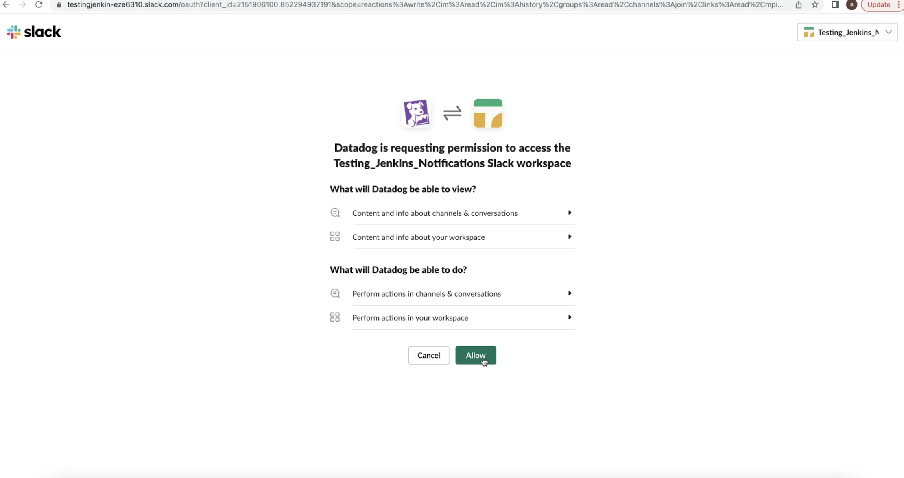

# Slack Integration and notification
Connect Slack to Datadog to help your team collaborate by:

* Sharing graphs in private or public Slack channels.
* Receiving alerts and notifications from Datadog within Slack.
* Muting triggering monitors and declaring incidents from Slack.

What you’ll need:

  Admin or Standard role permissions for your Datadog account (unless your organization has created custom roles)

1. In the Slack App: 

Select your workspace and chose/create the slack channel for datadog alerts to be triggered in.

2. In Datadog UI:

* Navigate to Integration -> select slack

* Click on Configure -> connect slack account 

   

* Select your intended worksapce from drop down in the top right corner.

* Click on add channel -> type the name of the channel if it is not showing and then click on 'save'.

   

3. In Slack:

* Under apps -> datadog > click on 'add this app to a channel'

* A new message should pop up in the channel saying 'datadog was added to this channel'.

4. Test the Integration:

* In datadog app, go to monitor -> edit -> test notofication

* A sample notification should be triggered in the channel confirming the Datadog-slack integration is successful.
