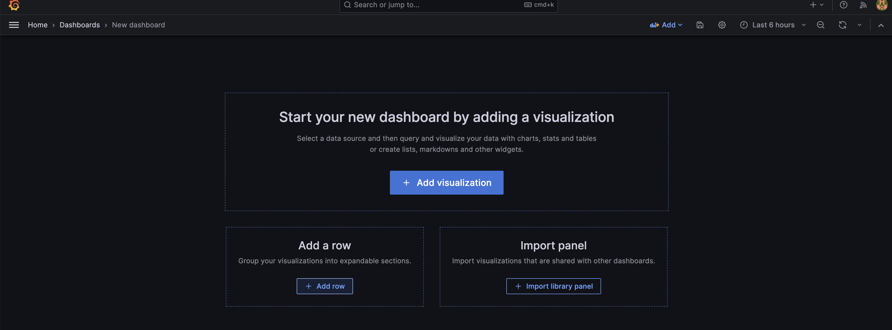
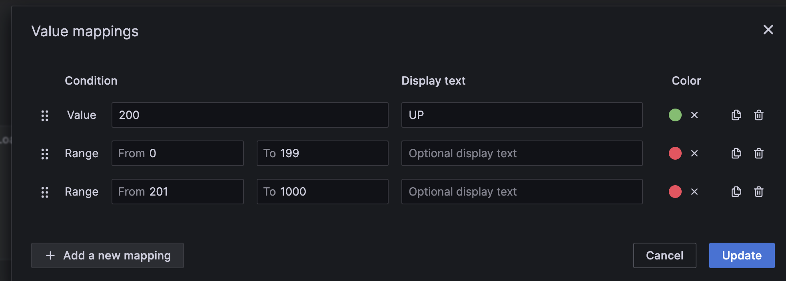
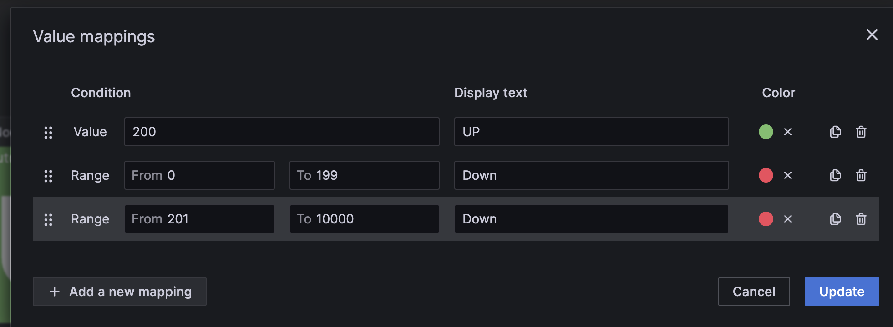

# Prometheus Dashboards

Grafana is used as a dashboard tool for Prometheus.

The dashboard allows us to analyze data from across our entire system in a single pane of glass. It enables our team to immediately benefit from dynamic views without requiring query language or coding.

## Installing and Configuring Grafana

This article provides step-by-step guidance to [install Grafana server locally](https://grafana.com/docs/grafana/latest/setup-grafana/installation/debian/).

After the successful installation, configure the data source for Prometheus. The following article provides step-by-step instructions for [data source configuration](https://prometheus.io/docs/visualization/grafana/#creating-a-prometheus-data-source) configuration.

## Considerations for creating Prometheus Dashboards

### Define your goals

You need to have clarity on what you want to show and monitor in your dashboard and your audience; e.g., the L1 and L2 operations teams will require a different set of dashboards versus somebody at the management who wants an overall summary of the infrastructure footprint

### Choose the right metrics

Not all metrics are created equal; some are more important than others. Choose the metrics that are important to you. We have listed all the important metrics that are critical to your Automated Infrastructure.

This [Reference Metrics](./Prometheus_Reference_Metrics_List.md) guides the monitoring of Automate HA in the Chef Managed Deployment style. You can use this guidance to build metrics and dashboards for other deployment styles

### Use the right visualizations

Prometheus offers a variety of visualizations. Choose the visualizations best suited for the metrics you are tracking. For example, if you are monitoring CPU usage, you might use a line chart. If you are tracking errors, use a heatmap.

### Add context

Don't just show your metrics. Add context to your dashboard by adding labels, descriptions, and annotations. This will help you and your team understand the meaning of metrics and why they are essential.

### Ease of use

Your dashboard should be easy to use. Ensure the layout is clear and the visualizations are easy to understand. You can also add filters and alerts to make it even easier to use your dashboard.

## Types of dashboards to consider

**Screenboards:** Screenboards are designed for ad-hoc analysis and troubleshooting. They allow you to create a custom layout of widgets and panels to visualize your data.

**Timeboards:** Timeboards are designed for monitoring and alerting. They show a historical view of your data over time and can be used to set alerts and notifications.

## Chef Automate HA Recommended Dashboards

Chef recommends the following dashboards for Chef Automate HA implementations:

* Component Health Dashboard

* OpenSearch Dashboard

* PostgreSQL Dashboard

* System Dashboard

## Dashboards in Grafana

Once dashboard objectives are defined, they can be created or imported if they already exist in the community.

### Creating a Dashboard

The article provides detailed guidance to [create a dashboard in Grafana with Prometheus](https://grafana.com/docs/grafana/latest/dashboards/build-dashboards/create-dashboard/).

This section will list the steps to create a dashboard for Chef Automate HA component health dashboard. This dashboard will provide the following:

* Status of load balancers for Chef Automate and Chef Infra Servers in row 1.

* Status of all nodes for Chef Automate and Chef Infra in row 2.

* Status of all services within each Chef Automate node in row 3.

* Status of all services within each Chef Infra node in row 3.

### Prerequisites

* All Chef Automate, and Chef Infra Server nodes must be configured with the black box exporter. For Blackbox exporter setup, refer to the [agent installation documentation](./Prometheus-agent-installation-configuration.md).

* Configure the Prometheus server with the required jobs to collect metrics to feed this dashboard. Refer to the [Prometheus.yml file](./prometheus.yml) for the detailed job configurations.

1. Login to Grafana portal `http://<< ip >>:3000)` with your credentials.

1. On the left-hand side, click on Dashboards --> New Dashboard. You will be directed to a new Dashboard screen.

    

1. Add 4 Rows and modify the title as shown below:

    * **Row 1:** Chef Automate Load Balancer Status.

    * **Row 2:** Chef Frontend Server Status.

    * **Row 3:** Chef Automate Services Status by nodes.

    * **Row 4:** Chef Infra Services Status by nodes.

1. Add Visualization:

    * **Title:** Chef Automate Load Balancer

    * **Query:** probe_http_status_code{job="chef-automate-url"}

    * **Visualization Type:** Stat

    * **Stat styles -> Graph mode:** None

    * **Color Scheme:** From thresholds (by value)

    * Value Mappings:

        

    * Move the newly created visualization under row 1: Chef Automate Load Balancer Status.

1. Add Visualization:

    * **Title:** Chef Server Load Balancer

    * **Query:** probe_http_status_code{job="chef-server-url"}

    * **Visualization Type:** Stat

    * **Stat styles -> Graph mode:** None

    * **Color Scheme:** From thresholds (by value)

    * Value Mappings:

        

    * Move the newly created visualization under row 1: Chef Automate Load Balancer Status

1. Add Visualization:

    * **Title:** Chef Automate Nodes

    * **Query:** avg(probe_http_status_code{job=~"automate-services-.*"}) by (job)

    * Transform:

    Match : {job="(\w.*)"}

    Replace:  $1

    * Visualization Type: Stat
    * Stat styles -> Graph mode: None
    * Stat styles -> Text alignment: Center
    * Color Scheme: From thresholds (by value)

    * Value Mappings:

        [Chef Automate value mapping](./images/chef_services_vm.png)

    * Move the newly created visualization under row 2: Chef Frontend Server Status

1. Add Visualization

    * Title: Chef Infra Nodes
    * Query: avg(probe_http_status_code{job=~"chef-server-services-.*"}) by (job)

    * Transform:
    Match : {job="(\w.*)"}

    Replace:  $1

    * Visualization Type: Stat
    * Stat styles -> Graph mode: None
    * Stat styles -> Text alignment: Center
    * Color Scheme: From thresholds (by value)

    * Value Mappings:

        

    * Move the newly created visualization under row 2: Chef Frontend Server Status

1. Add Visualization

    * Repeat the following steps for each Automate node and update title, query, and transform match for each Automate node.

    * Title: Chef Automate - Node 1
    * Query: probe_http_status_code{job=~"automate-services-node-01"}

    * Transform:

    Match: probe_http_status_code{instance="http:\/\/localhost:9631\/services\/(\w.*)\/default\/health", job="automate-services-node-01"}

    Replace:  $1

    * Visualization Type: Stat
    * Stat styles -> Graph mode: None
    * Stat styles -> Text alignment: Center
    * Color Scheme: From thresholds (by value)

    * Value Mappings:

        

    * Move the newly created visualization(s) under row 3: Chef Automate Services Status by nodes

1. Add Visualization

    * Repeat the following steps for each Chef Infra node and update the title, query, and transform match for each node.

    * Title: Chef Infra - Node 1
    * Query: probe_http_status_code{job=~"chef-server-services-node-01"}

    * Transform:

    Match: probe_http_status_code{instance="http:\/\/localhost:9631\/services\/(\w+-\w.*)\/default\/health", job="chef-server-services-node-01"}

    Replace:  $1

    * Visualization Type: Stat
    * Stat styles -> Graph mode: None
    * Stat styles -> Text alignment: Center
    * Color Scheme: From thresholds (by value)

    * Value Mappings:

        

    * Move the newly created visualization(s) under row four: Chef Infra Services Status by nodes

1. Save the dashboard. View the [JSON](./dashboards/Chef%20Automate%20HA%20-%20Component%20Health-1688729683107.json) copy of the dashboard for reference.

1. Make the necessary job configuration changes to make this dashboard work in your environment.

## Importing a Dashboard

The Prometheus community has contributed various dashboards, which may be configured to monitor Chef Automate HA implementation.

* [System Dashboard](https://grafana.com/grafana/dashboards/1860-node-exporter-full/)

* [Postgres Dashboard](https://grafana.com/grafana/dashboards/9628-postgresql-database/)

* [Open Search Dashboard](https://grafana.com/grafana/dashboards/15178-opensearch-prometheus/)

The following process explains the process of importing existing dashboards in Grafana.

* Refer to the [Grafana dashboard repository](https://grafana.com/grafana/dashboards/) for available dashboards.
* Review the available dashboards that meet your specific requirements.
* Refer to the identified dashboard for its specific exporter configuration requirements.
* Follow the steps to import the dashboard described in the [article](https://grafana.com/docs/grafana/latest/dashboards/manage-dashboards/#export-and-import-dashboards).
