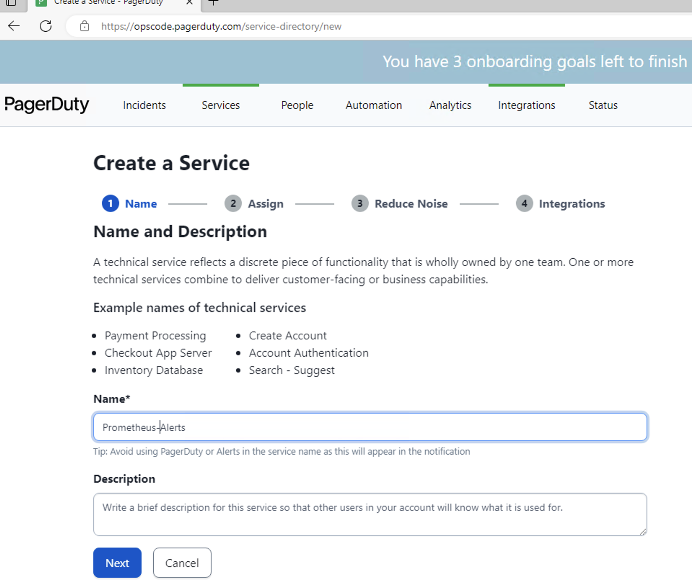
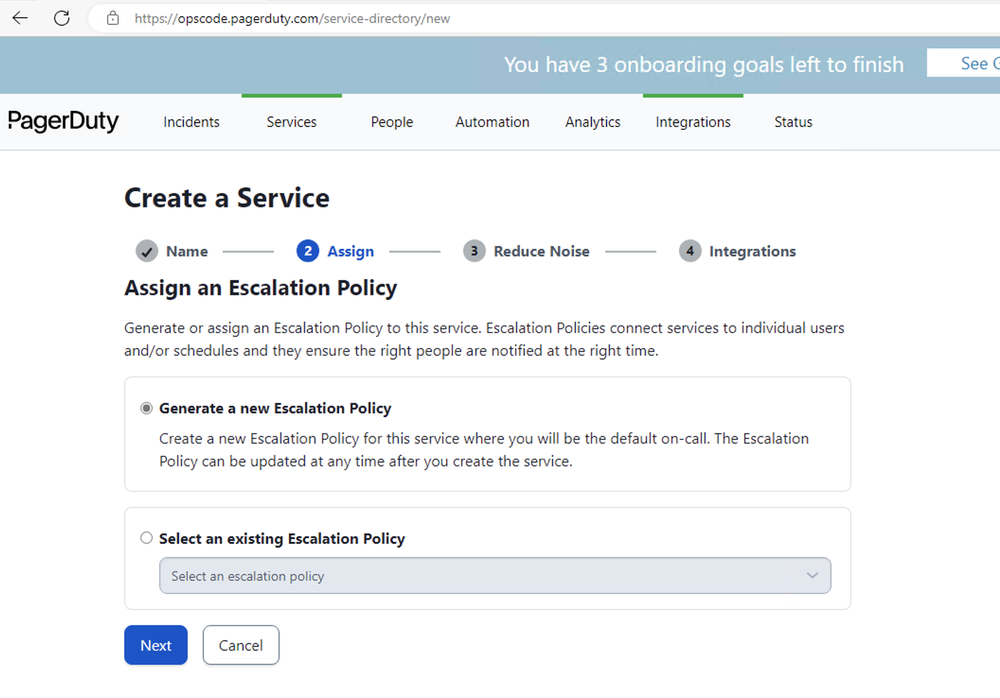
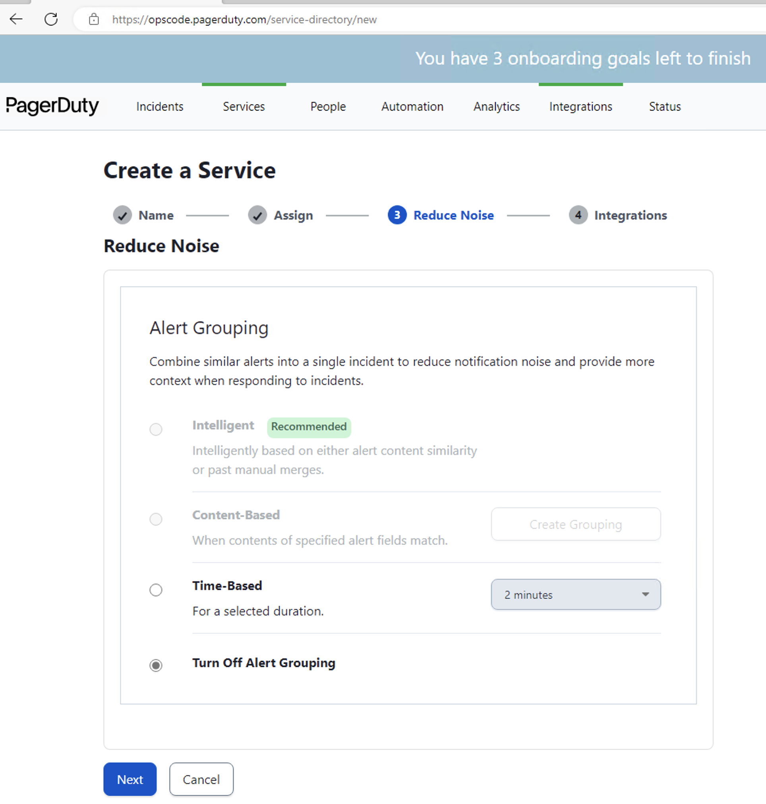
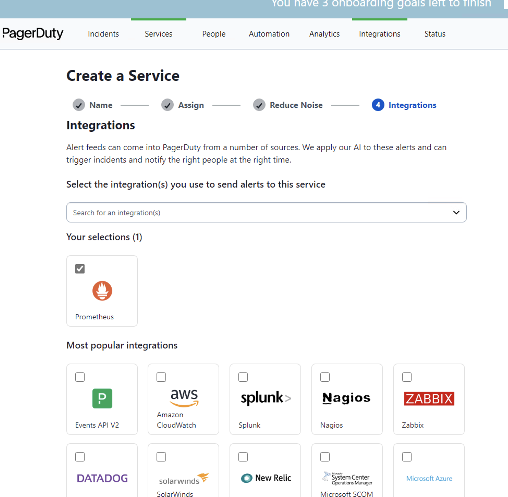
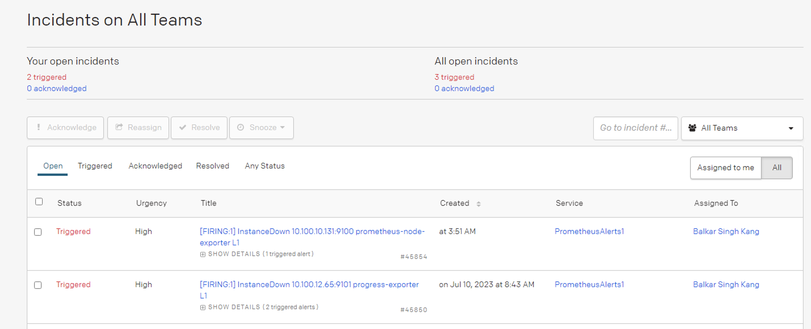
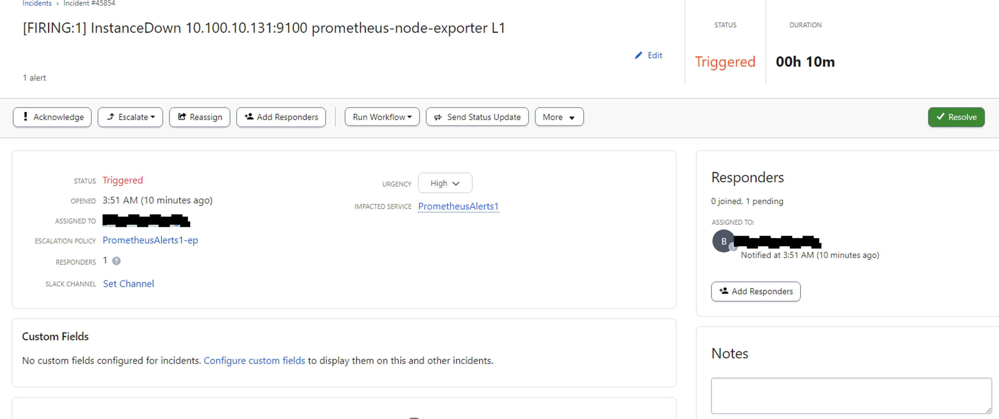

# Prometheus and PagerDuty Integration
Connecting PagerDuty to Prometheus to:

* Notify on-call responders based on alerts triggered from prometheus.
* See incidents and escalations.
* Get daily reminders as to who is on-call.

What you’ll need:

 * Admin or Standard role permissions for your prometheus account (unless your organization has created custom role)
 * Permissions to create new service in PagerDuty 

## Prometheus and PagerDuty Integration

### Prerequisites

The following steps provides the guidance to prepare pagerduty receiver for the alert manager to send alerts. 

* Refer to the [configuration guide](https://grafana.com/blog/2020/02/25/step-by-step-guide-to-setting-up-prometheus-alertmanager-with-slack-pagerduty-and-gmail/) for step-by-step guidance to configure PagerDuty service to receive notifications from the prometheus alertmanager.

* PagerDuty Configuration  
    - Access your pagerduty portal with permissions to create a new service. 
    - Create a new Configuration Services. The following screenshots will provide guidance to create pagerduty service.

      - Click New Service.
      - Specify the Service Name
      
      - Assign Escalation Policy. Click Next
      
      - Reduce Noise. Click Next
      
      - Select Integration Service as Prometheus and click Create Service.
      
    - After creating the service, copy the service key. e.g. `98c3d3add5xe4f_TAMPERED_fdc62`. This service key will be used in alertmanager configuration.
  

### Configure AlertManager for Pagerduty

Before performing the following steps, please ensure alertmanager is installed and configured to run as a service. Refer to the [alertmanager installation guide](./Prometheus_Monitor_configuration_and_alerting.md).

The following configuration is designed to receive alerts with severity level `L1`. By default, all alerts will go to Slack. However, the alerts with severity level `L1` will be sent to Padgerduty.

* Perform the following steps to configure alert manager to integration with pagerduty. 

* Update the service key generated by pagerduty in the previous step.

Please note: The keys and webhooks provided in the following configuration are tampered. The keys and webhooks must be updated as per the environment. Add the following configurations to alertmanager.yml file. Refer to the final [alertmanager configuration](.configs/alertmanager.yml) file.

```
vi /etc/alertmanager/alertmanager.yml
```

```
routes:
    - match:
        severity: L1
      receiver: pagerduty
      group_by: ['...']

receivers:
  - name: pagerduty
    pagerduty_configs:
    - service_key: 98c3d3add5de4f0dc0726243ee3fdc62
      send_resolved: true
```

Run the following command to restart alert manager service

```
systemctl daemon-reload
systemctl start alertmanager
systemctl status alertmanager
```

## PagerDuty Alerts
The following screenshots will show the PagerDuty Console and Alert as example.


