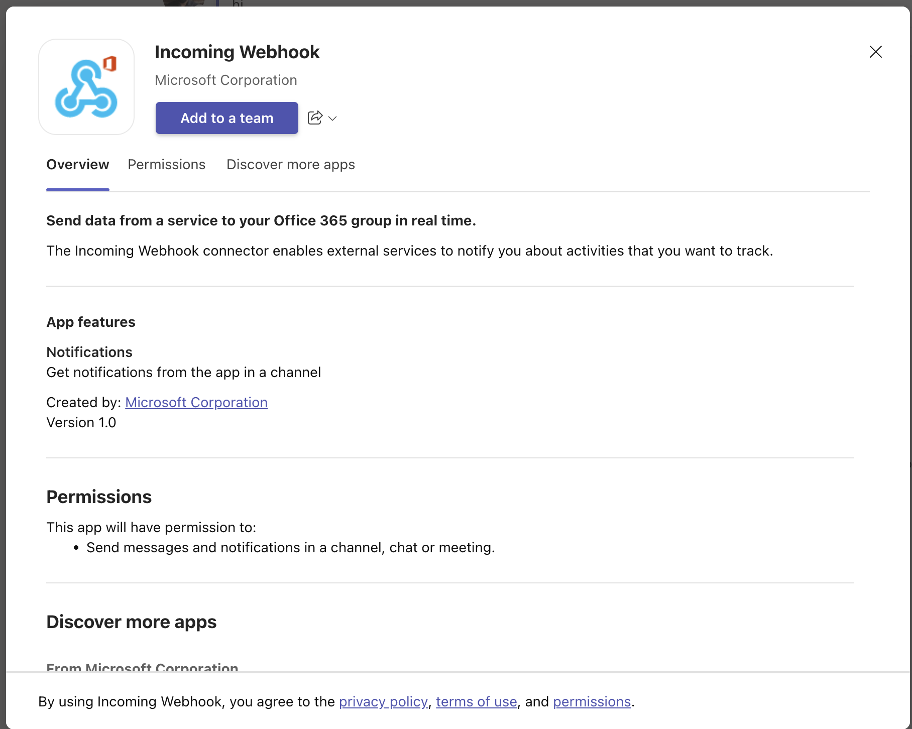
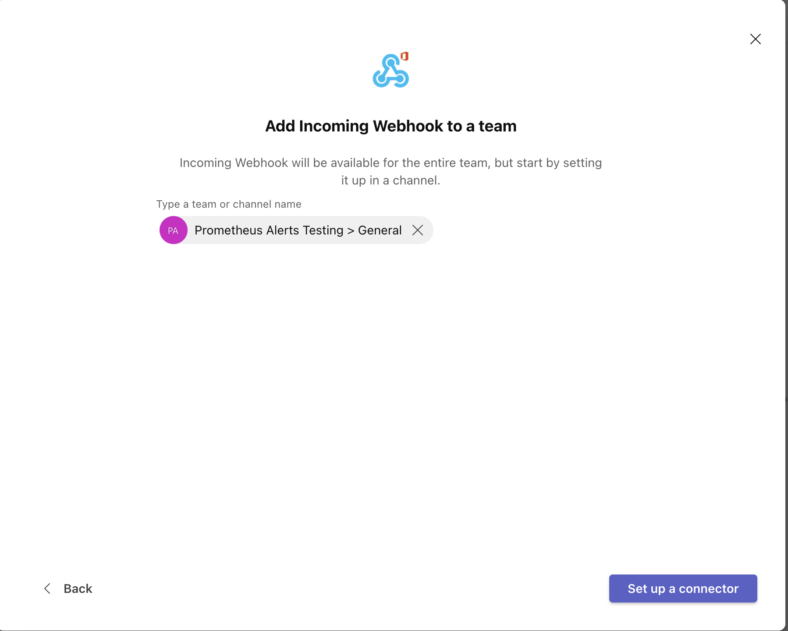
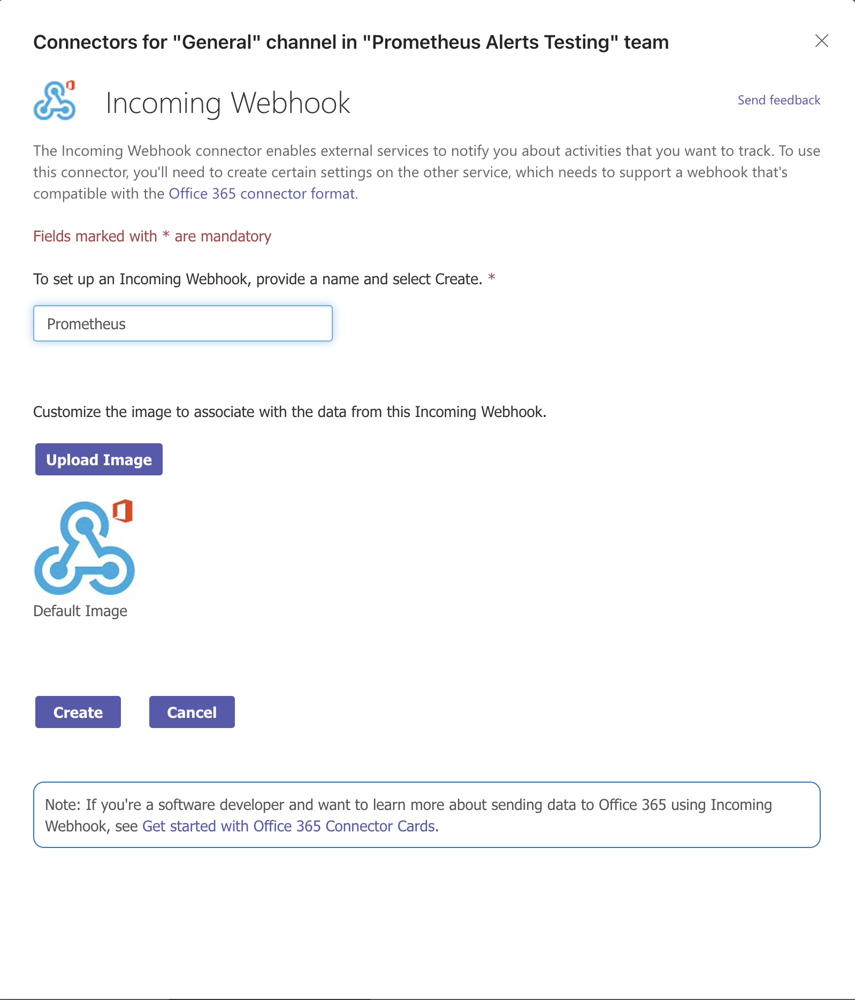
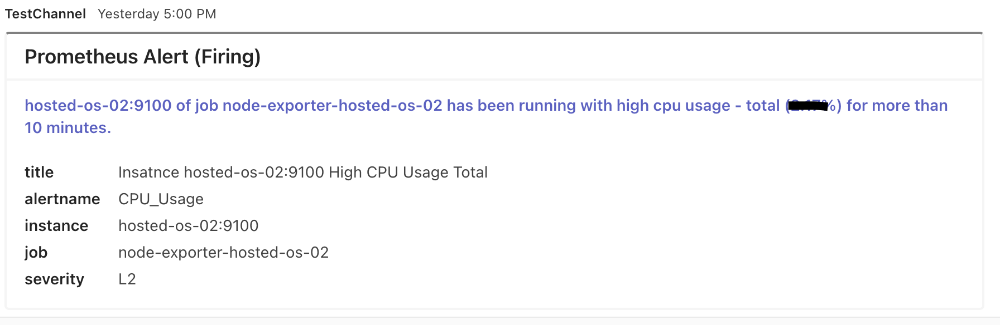

# MS Teams Integration and Notification

The scope here is to connect MS Teams to Prometheus to:

1. Notify on-call responders based on alerts triggered from Prometheus.

1. See incidents and escalations.

1. Get daily reminders as to who is On-call.

## Configure AlertManager for MS Teams

Before performing the following steps, please ensure Alertmanager is installed and configured to run as a service. Refer to the [Alertmanager installation guide](./Prometheus_Monitor_configuration_and_alerting.md)

## Prometheus and MS Teams Integration

The following steps guide the preparation of an MS Teams receiver for the Alertmanager to send alerts. Refer to the [Prometheus MS Teams documentation](https://github.com/prometheus-msteams/prometheus-msteams/releases) for more details.

### Configure MS Teams

1. Create Teams.

1. Create a Team Channel.

    * Create a channel in Ms-teams where you want to send alerts.

1. Create Incoming Webhook.

    * Select connectors(found in channel options), and then search for the ‘incoming webhook’ connector.

        

    * Create a webhook for this channel. Incoming webhooks send notifications from external services to track the activities.

        

        

    * Select Create.

    * Copy the Webhook URL and click done.

This webhook URL will be used in the next step.

#### Install and Configure Docker Image

```sh
apt install docker.io
```

1. The Prometheus-steams proxy container is configured on the Prometheus server with port number 2000. Please ensure the firewall is opened for this port.

2. Updated `TEAMS_INCOMING_WEBHOOK_URL` with the URL link generated above.

3. Run the following command to start the docker container.

```sh
docker run -d -p 2000:2000 \
    --name="promteams" \
    -e TEAMS_INCOMING_WEBHOOK_URL="https://progresssoftware.webhook.office.com/webhookb2/19e1c444-fa6a-4d9a-b339-c527940dbaac@db266a67-cbe0-4d26-ae1a-d0581fe03535/IncomingWebhook/43f87f7d1724404394e28b24c50deb51/890e3fec-12ba-4296-8e94-6018f68218961" \
    -e TEAMS_REQUEST_URI=alertmanager \
    quay.io/prometheusmsteams/prometheus-msteams
```

## Configure Alertmanager

* Add the following configuration in the `alartmanager.yml` file. Refer to the [alertmanager.yml](./alertmanager.yml) file for full configuration.

```sh
vi /etc/alertmanager/alertmanager.yml
```

```sh
route:
  Routes:
    - match:
        severity: L2
      receiver: prometheus-msteams
      group_by: ['...']
receivers:
  - name: 'prometheus-msteams'
    webhook_configs: # https://prometheus.io/docs/alerting/configuration/#webhook_config
    - send_resolved: true
      url: 'http://localhost:2000/alertmanager'
```

Restart Alertmanager and Prometheus server by running the following command:

```sh
systemctl restart alertmanager.service
systemctl restart prometheus.service
```

## MS Team Alert Example

The screenshot below is an example of Prometheus alerts in MSTeams.


