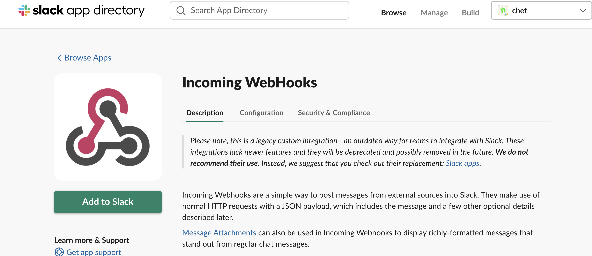

# Prometheus and Slack Integration and Notification
Connect Slack to Prometheus to:

* All Level 2 alerts must be sent to Slack.

What you’ll need:

 * Admin or Standard role permissions for your prometheus account (unless your organization has created custom role).
 * Permissions to create new channel in Slack. 

## Prometheus and Slack Integration
### Prerequisites
The following steps provides the guidance to prepare Slack receiver for the alert manager to send alerts. 

*  Refer to this [guide](https://grafana.com/blog/2020/02/25/step-by-step-guide-to-setting-up-prometheus-alertmanager-with-slack-pagerduty-and-gmail/) for step-by-step guidance to configure Slack notification from the prometheus alertmanager.

* Slack Notification Configuration
  - Create a slack channel. The following screenshots will provide guidance to create 

  - Select All Channels and click Create Channel
  

  - Specify Channel Name
   
  
  - Select Visibility
   

* Once Channel is created, create webhook
 - Click on Slack administration -> Manage Apps 
  
 - Search for "Incoming Webhooks"
  
 - Add Incoming hooks to Slack
  
 - Select Channel and click on "Add Incoming Webhook Integration"
  
 - Copy the Webhook api url.
  

* The api_url will be used in alertmanager configuration.

### Configure AlertManager for Slack

Before performing the following steps, please ensure alertmanager is installed and configured to run as a service. Refer to the [alertmanager installation guide](./Prometheus_Monitor_configuration_and_alerting.md)

Perform the following steps to configure alert manager to integration with Slack. 

* Update the alertmanager.yml file.
```
vi /etc/alertmanager/alertmanager.yml
```

* Update the api_key generated by Slack in the step above.

* Update the name of the channel created above.

Please note: The webhooks provided in the following configuration are tampered. The webhooks must be updated as per the environment.

* Title and Text are optional, we have added an example to to customize alert template.

```
route:
  # A default receiver
  receiver: slack

  routes:
    - match:
        severity: L2
      receiver: slack

receivers:
  - name: slack
    slack_configs:
      - api_url: 'https://hooks.slack.com/services/T03XXXS/B_TAMPERED_API_URL_DqW'
        send_resolved: true
        channel: '#prometheus-monitoring'
        title: |-
          [{{ .Status | toUpper }}{{ if eq .Status "firing" }}:{{ .Alerts.Firing | len }}{{ end }}] {{ .CommonLabels.alertname }} for {{ .CommonLabels.job }}
          {{- if gt (len .CommonLabels) (len .GroupLabels) -}}
            {{" "}}(
            {{- with .CommonLabels.Remove .GroupLabels.Names }}
              {{- range $index, $label := .SortedPairs -}}
                {{ if $index }}, {{ end }}
                {{- $label.Name }}="{{ $label.Value -}}"
              {{- end }}
            {{- end -}}
            )
          {{- end }}
        text: >-
          {{ range .Alerts -}}
          *Alert:* {{ .Annotations.title }}{{ if .Labels.severity }} - `{{ .Labels.severity }}`{{ end }}

          *Description:* {{ .Annotations.description }}

          *Details:*
             {{ range .Labels.SortedPairs }} • *{{ .Name }}:* `{{ .Value }}`
             {{ end }}
          {{ end }}
```

Run the following command to restart alertmanager service

```
systemctl daemon-reload
systemctl start alertmanager
systemctl status alertmanager
```

###  Alerts Example
The following screenshot shows an example of an Prometheus alert in Slack
