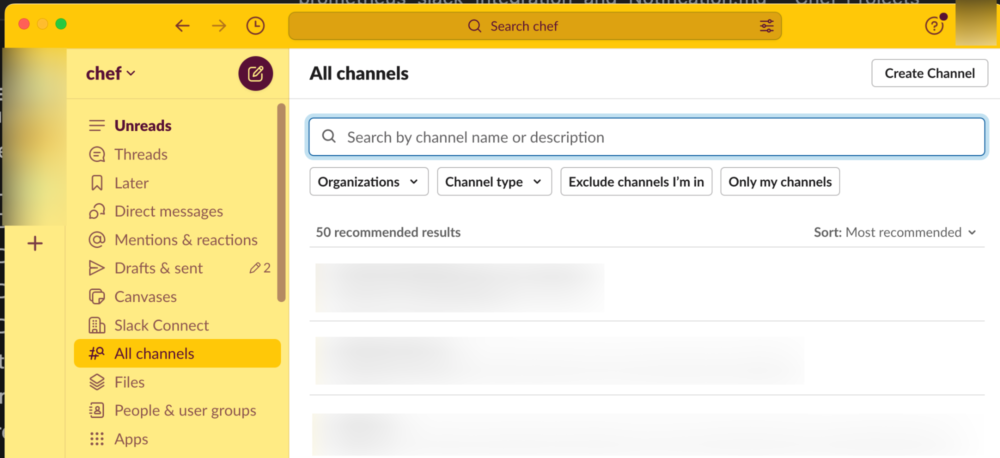
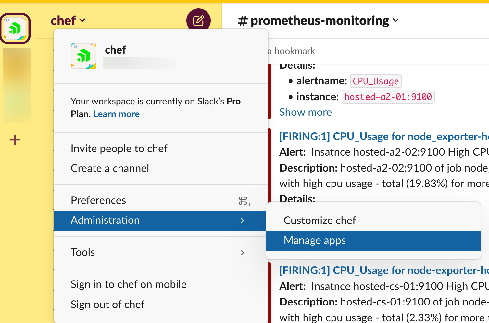

# Prometheus and Slack Integration and Notification

Connect Slack to Prometheus to:

* All Level 2 alerts must be sent to Slack.

What you’ll need:

* Admin or Standard role permissions for your Prometheus account (unless your organization has created a custom role).

* Permission to create a new channel in Slack.

## Prometheus and Slack Integration

### Prerequisites

The following steps guide preparing Slack receivers for the alert manager to send alerts.

1. Refer to this [guide](https://grafana.com/blog/2020/02/25/step-by-step-guide-to-setting-up-prometheus-alertmanager-with-slack-pagerduty-and-gmail/) for step-by-step guidance to configure Slack notifications from the Prometheus Alertmanager.

1. Slack Notification Configuration

    * Create a Slack channel. The following screenshots will guide you in creating.

    * Select **All Channels** and then select **Create Channel**.

        

    * Specify Channel Name.

        

    * Select Visibility.

        

1. Once Channel is created, create a webhook using the following steps:

    * Select **Slack administration -> Manage Apps**.

        

    * Search for "Incoming Webhooks".

        

    * Add Incoming hooks to Slack.

        

    * Select Channel and then select **Add Incoming Webhook Integration**.

        

    * Copy the Webhook API URL.

        

1. The API_url will be used in the Alertmanager configuration.

### Configure AlertManager for Slack

Before performing the following steps, please ensure the Alertmanager is installed and configured to run as a service. Refer to the [Alertmanager Installation Guide](./Prometheus_Monitor_configuration_and_alerting.md)

Perform the following steps to configure the Alertmanager to integrate with Slack.

1. Update the alertmanager.yml file.

    ```sh
    vi /etc/alertmanager/alertmanager.yml
    ```

1. Update the api_key generated by Slack in the step above.

1. Update the name of the channel created above.

Please note: The webhooks provided in the following configuration are tampered with. They must be updated according to the environment.

1. Title and Text are optional; we have added an example to customize the alert template.

```sh
route:
  # A default receiver
  receiver: slack
  routes:
    - match:
        severity: L2
      receiver: slack
receivers:
  - name: slack
    slack_configs:
      - api_url: 'https://hooks.slack.com/services/T03XXXS/B_TAMPERED_API_URL_DqW'
        send_resolved: true
        channel: '#prometheus-monitoring'
        title: |-
          [{{ .Status | toUpper }}{{ if eq .Status "firing" }}:{{ .Alerts.Firing | len }}{{ end }}] {{ .CommonLabels.alertname }} for {{ .CommonLabels.job }}
          {{- if gt (len .CommonLabels) (len .GroupLabels) -}}
            {{" "}}(
            {{- with .CommonLabels.Remove .GroupLabels.Names }}
              {{- range $index, $label := .SortedPairs -}}
                {{ if $index }}, {{ end }}
                {{- $label.Name }}="{{ $label.Value -}}"
              {{- end }}
            {{- end -}}
            )
          {{- end }}
        text: >-
          {{ range .Alerts -}}
          *Alert:* {{ .Annotations.title }}{{ if .Labels.severity }} - `{{ .Labels.severity }}`{{ end }}
          *Description:* {{ .Annotations.description }}
          *Details:*
             {{ range .Labels.SortedPairs }} • *{{ .Name }}:* `{{ .Value }}`
             {{ end }}
          {{ end }}
```

Run the following command to restart the Alertmanager service

```sh
systemctl daemon-reload
systemctl start alertmanager
systemctl status alertmanager
```

### Alerts Example

The following screenshot shows an example of a Prometheus alert in Slack


